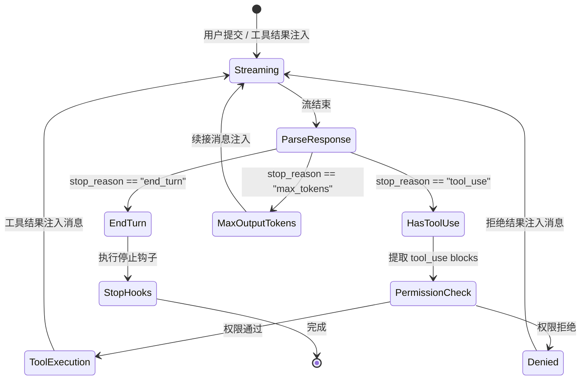
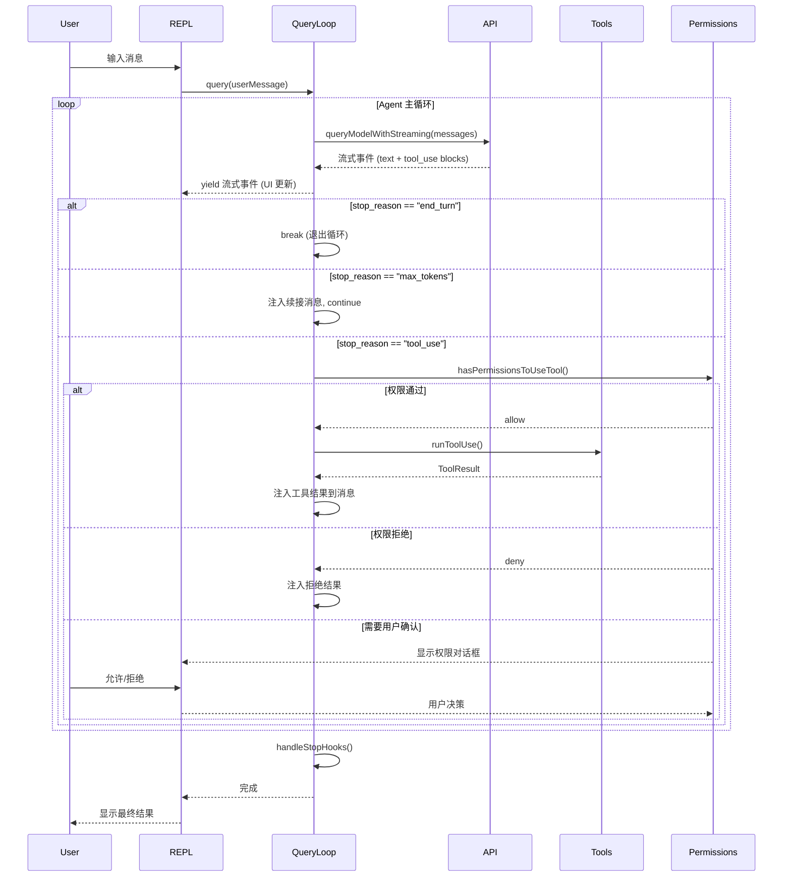

# Agent 主循环深度解析

> 本文是理解 Claude Code Agent 运行机制的核心文档。将从源码层面完整剖析 Agent Loop 的每一个步骤。

## 1. 概述

Agent 主循环是整个系统的"心脏"——它接收用户输入，调用 LLM API，解析模型响应中的工具调用，执行工具，将结果反馈给模型，如此循环直到模型认为任务完成。

```
用户输入 → query() → LLM API 流式调用 → 解析响应
    ↑                                        ↓
    ← 工具结果注入消息列表 ← 执行工具 ← 提取 tool_use blocks
```

## 2. 核心状态机

Agent Loop 本质是一个有限状态机，由 `query()` async generator 驱动：

### 2.1 状态定义

```typescript
// src/query.ts
type State = {
  messages: MessageParam[]          // 当前对话消息列表
  toolResults: ToolResultBlockParam[]  // 待发送的工具结果
  stopReason: string | null         // API 返回的停止原因
  wasAutoContinued: boolean         // 是否因 max-output-tokens 自动续接
  budgetExhausted: boolean          // token 预算是否耗尽
}
```

### 2.2 状态转换



## 3. query() 主函数详解

### 3.1 完整流程

```typescript
// src/query.ts (1729 行；queryLoop 为内部主循环)
export async function* query(
  userMessage: UserMessage,
  options: QueryOptions,
): AsyncGenerator<QueryEvent, void, void> {
  const config = getQueryConfig(options)    // 不可变配置快照
  const deps = productionDeps()             // 依赖注入

  // 初始化状态
  const state: State = {
    messages: [...history, userMessage],
    toolResults: [],
    stopReason: null,
    wasAutoContinued: false,
    budgetExhausted: false,
  }

  // 主循环
  while (true) {
    // Step 1: 调用 LLM API (流式)
    const stream = await queryModelWithStreaming(state.messages, config)

    // Step 2: 解析流式响应
    for await (const event of stream) {
      if (event.type === 'content_block_stop') {
        // 收集 content blocks
      }
      if (event.type === 'message_stop') {
        state.stopReason = event.message.stop_reason
      }
      yield event  // 向上层 (REPL) 流式推送
    }

    // Step 3: 检查停止原因
    if (state.stopReason === 'end_turn') {
      break  // 模型认为任务完成，退出循环
    }

    if (state.stopReason === 'max_tokens') {
      // max-output-tokens 恢复：注入续接消息
      state.messages.push({
        role: 'assistant',
        content: assistantBlocks + continuationHint
      })
      state.messages.push({
        role: 'user',
        content: [{ type: 'text', text: 'Please continue.' }]
      })
      state.wasAutoContinued = true
      continue  // 继续循环
    }

    // Step 4: 提取 tool_use blocks
    const toolUseBlocks = extractToolUseBlocks(assistantMessage)

    if (toolUseBlocks.length === 0) {
      break  // 无工具调用，退出
    }

    // Step 5: 执行工具
    const results = await runTools(toolUseBlocks, config, deps)

    // Step 6: 注入工具结果到消息列表
    state.messages.push(assistantMessage)
    state.messages.push({
      role: 'user',
      content: results.map(r => ({
        type: 'tool_result',
        tool_use_id: r.toolUseId,
        content: r.content,
        is_error: r.isError,
      }))
    })

    // Step 7: Token 预算检查
    if (budgetTracker.isExhausted()) {
      state.budgetExhausted = true
      break
    }

    // Step 8: 自动压缩检查
    if (shouldAutoCompact(state.messages)) {
      await autoCompact(state.messages)
    }
  }

  // Step 9: 执行停止钩子
  yield* handleStopHooks(state)
}
```

### 3.2 关键机制

#### 3.2.1 QueryConfig 不可变快照

```typescript
// src/query/config.ts
type QueryConfig = {
  sessionId: string
  gates: PermissionGates       // 权限门控
  tools: Tool[]                // 可用工具列表
  model: string                // 模型标识
  thinkingConfig: ThinkingConfig  // 思考模式配置
  maxTokens: number            // 最大输出 token
  // ... 每次查询创建不可变快照，防止并发修改
}
```

#### 3.2.2 依赖注入 (QueryDeps)

```typescript
// src/query/deps.ts
type QueryDeps = {
  callModel: (messages, config) => AsyncIterable<StreamEvent>
  microcompact: (messages) => Promise<MessageParam[]>
  autocompact: (messages) => Promise<MessageParam[]>
  uuid: () => string
}

function productionDeps(): QueryDeps {
  return {
    callModel: queryModelWithStreaming,
    microcompact: partialCompactConversation,
    autocompact: autoCompactConversation,
    uuid: crypto.randomUUID,
  }
}
```

这种设计使得测试时可以注入 mock 依赖，无需调用真实 API。

#### 3.2.3 Max-Output-Tokens 恢复

当模型输出达到 `max_tokens` 上限时，模型返回 `stop_reason: "max_tokens"`。Agent Loop 检测到此情况后：

1. 将已有的 assistant content blocks（包含未完成的 tool_use）加入消息列表
2. 注入一条合成用户消息："Please continue."
3. 标记 `wasAutoContinued = true`
4. 继续循环，让模型继续输出

这对长代码生成场景至关重要——模型可能在函数写到一半时被截断。

#### 3.2.4 Token 预算追踪

```typescript
// src/query/tokenBudget.ts
class BudgetTracker {
  private static COMPLETION_THRESHOLD = 0.9   // 90% 预算用完 → 标记完成
  private static DIMINISHING_THRESHOLD = 500  // 剩余 <500 token → 收益递减信号

  isExhausted(): boolean {
    return this.usedTokens / this.totalBudget >= this.COMPLETION_THRESHOLD
  }

  isDiminishing(): boolean {
    return this.totalBudget - this.usedTokens < this.DIMINISHING_THRESHOLD
  }
}
```

## 4. 流式 API 调用

### 4.1 queryModelWithStreaming

```typescript
// src/services/api/claude.ts (~3489 行)
async function* queryModelWithStreaming(
  messages: MessageParam[],
  config: QueryConfig,
): AsyncGenerator<StreamEvent> {
  const client = getAnthropicClient()  // 根据 provider 路由

  // 构建请求参数
  const params: MessageCreateParams = {
    model: resolveModel(config.model),
    messages: prepareMessagesForApi(messages),
    system: buildSystemPrompt(config),
    tools: prepareToolsForApi(config.tools),
    max_tokens: config.maxTokens,
    stream: true,
    // 条件参数
    ...(config.thinkingConfig.enabled && {
      thinking: {
        type: 'enabled',
        budget_tokens: config.thinkingConfig.budgetTokens,
      }
    }),
    // 缓存控制
    ...(config.cacheControl && {
      cache_control: { type: 'ephemeral' }
    }),
  }

  // 流式请求 + 重试逻辑
  const stream = await withRetry(
    () => client.messages.create(params),
    { maxRetries: 3, backoff: exponentialBackoff }
  )

  // 解析流事件
  for await (const event of stream) {
    switch (event.type) {
      case 'message_start':
        // 包含 message id, model, usage
        yield { type: 'message_start', ...event }
        break

      case 'content_block_start':
        // 新的 content block (text 或 tool_use)
        yield { type: 'content_block_start', ...event }
        break

      case 'content_block_delta':
        // 增量文本或工具输入 JSON
        yield { type: 'content_block_delta', ...event }
        break

      case 'content_block_stop':
        // content block 结束
        yield { type: 'content_block_stop', ...event }
        break

      case 'message_delta':
        // 包含 stop_reason, usage
        yield { type: 'message_delta', ...event }
        break

      case 'message_stop':
        yield { type: 'message_stop', ...event }
        break
    }
  }
}
```

### 4.2 流空闲看门狗

为防止 API 连接假死，系统实现了流空闲看门狗：

```typescript
// 如果在指定时间内没有收到任何流事件，触发超时
const STREAM_IDLE_TIMEOUT_MS = 90_000  // 90s（CLAUDE_STREAM_IDLE_TIMEOUT_MS 可覆盖；另 STALL_THRESHOLD_MS = 30s）

// 看门狗逻辑：每个事件重置计时器，超时则中止请求
const idleTimer = setTimeout(() => {
  abortController.abort(new Error('Stream idle timeout'))
}, STREAM_IDLE_TIMEOUT_MS)
```

### 4.3 VCR (Video Cassette Recorder) 录制

API 调用可以被录制和回放，用于测试和调试：

```typescript
// 录制模式：将请求/响应写入 JSONL 文件
// 回放模式：从文件读取响应，不调用真实 API
const vcrMode = process.env.CLAUDE_CODE_VCR  // 'record' | 'playback'
```

## 5. 工具编排与执行

### 5.1 并发安全 vs 独占批处理

```typescript
// src/services/tools/toolOrchestration.ts
async function runTools(
  toolUseBlocks: ToolUseBlock[],
  config: QueryConfig,
  deps: QueryDeps,
): Promise<ToolResult[]> {

  // 分区：并发安全的工具可以并行，独占工具串行
  const [concurrentSafe, exclusive] = partitionByConcurrency(toolUseBlocks)

  // 并发安全工具并行执行
  const concurrentResults = await Promise.all(
    concurrentSafe.map(block => runToolUse(block, config, deps))
  )

  // 独占工具逐个执行
  const exclusiveResults: ToolResult[] = []
  for (const block of exclusive) {
    const result = await runToolUse(block, config, deps)
    exclusiveResults.push(result)
  }

  return [...concurrentResults, ...exclusiveResults]
}
```

### 5.2 StreamingToolExecutor

当模型还在流式输出时，某些工具调用可以被提前识别并开始执行：

```typescript
// src/services/tools/StreamingToolExecutor.ts (530 行)
class StreamingToolExecutor {
  // 在流式输出过程中，一旦完整的 tool_use block 到达
  // （content_block_stop 事件），立即开始执行
  // 而不是等待整个消息完成

  onContentBlockStop(block: ContentBlock) {
    if (block.type === 'tool_use') {
      this.pendingExecutions.add(
        runToolUse(block, this.config, this.deps)
      )
    }
  }
}
```

### 5.3 单工具执行 (runToolUse)

```typescript
// src/services/tools/toolExecution.ts (1745 行)
async function runToolUse(
  block: ToolUseBlock,
  config: QueryConfig,
  deps: QueryDeps,
): Promise<ToolResult> {

  // Step 1: 查找工具定义
  const tool = config.tools.find(t => t.name === block.name)
  if (!tool) {
    return { type: 'tool_result', tool_use_id: block.id, content: `Unknown tool: ${block.name}`, is_error: true }
  }

  // Step 2: 权限检查
  const permissionResult = await hasPermissionsToUseTool(tool, block.input, context)
  if (permissionResult === 'deny') {
    return { type: 'tool_result', tool_use_id: block.id, content: 'Permission denied', is_error: true }
  }
  if (permissionResult === 'ask') {
    // 向用户展示权限请求对话框，等待决策
    const userDecision = await requestUserPermission(tool, block.input)
    if (!userDecision.allowed) {
      return { type: 'tool_result', tool_use_id: block.id, content: 'User denied', is_error: true }
    }
  }

  // Step 3: 执行 PreToolUse hooks
  await runHooks('PreToolUse', { tool: tool.name, input: block.input })

  // Step 4: 调用工具 handler
  try {
    const result = await tool.call(block.input, toolUseContext)

    // Step 5: 执行 PostToolUse hooks
    await runHooks('PostToolUse', { tool: tool.name, input: block.input, result })

    // Step 6: 遥测
    recordToolUsage(tool.name, result.duration, result.tokenCount)

    return { type: 'tool_result', tool_use_id: block.id, content: result.content }
  } catch (error) {
    // PostToolUseFailure hooks
    await runHooks('PostToolUseFailure', { tool: tool.name, input: block.input, error })

    // MCP 认证错误特殊处理
    if (isMcpAuthError(error)) {
      return { type: 'tool_result', tool_use_id: block.id, content: 'MCP authentication required', is_error: true }
    }

    return { type: 'tool_result', tool_use_id: block.id, content: error.message, is_error: true }
  }
}
```

## 6. 停止钩子 (Stop Hooks)

当 Agent Loop 正常退出（`stop_reason === 'end_turn'`）时，系统执行一系列停止后处理：

```typescript
// src/query/stopHooks.ts (473 行)
async function* handleStopHooks(state: State): AsyncGenerator<HookEvent> {
  // 1. 提取记忆
  yield* extractMemories(state.messages)

  // 2. 任务钩子（如果有后台任务完成）
  yield* handleTaskHooks(state)

  // 3. 队友钩子（Swarm 模式下通知队友）
  yield* handleTeammateHooks(state)
}
```

## 7. 消息压缩 (Compaction)

长对话会超出模型的上下文窗口。系统实现了多级压缩策略：

### 7.1 压缩层级

| 层级 | 触发条件 | 方法 | 保留信息 |
|------|----------|------|----------|
| Micro-compact | 消息数 > 阈值 | 部分压缩 | 最近 N 轮完整保留 |
| Auto-compact | 上下文窗口 > 80% | 全量摘要 | 语义摘要 + 关键代码片段 |
| Emergency compact | API 返回 prompt-too-long | 紧急压缩 | 最小化保留 |

### 7.2 压缩流程

```
原始消息 (200轮)
  → 提取前 50 轮 → 调用 LLM 生成摘要 → 替换为摘要消息
  → 保留最近 20 轮原始消息
  → 最终: [摘要消息] + [最近 20 轮]  (大幅减少 token)
```

## 8. SideQuery 机制

除了主循环的查询外，系统还需要"旁路查询"用于分类、权限判断等：

```typescript
// src/utils/sideQuery.ts (236 行)
async function sideQuery(options: SideQueryOptions): Promise<SideQueryResult> {
  const client = getAnthropicClient()

  // 轻量级 API 调用，独立于主循环
  const result = await client.messages.create({
    model: options.model ?? getClassifierModel(),
    system: options.system,
    messages: options.messages,
    tools: options.tools,
    tool_choice: options.tool_choice,
    max_tokens: options.max_tokens ?? 1024,
    // ... 思考配置
  })

  // 遥测
  recordSideQueryUsage(options.querySource, result.usage)

  return result
}
```

**SideQuery 用途：**
- Auto 模式分类器（判断工具调用是否安全）
- 权限解释器（向用户解释为何需要权限）
- 会话搜索（在历史会话中搜索相关内容）
- 模型验证（验证 API Key 是否有效）

## 9. 完整时序图



## 10. 如何开发自己的 Agent Loop

基于以上分析，构建一个类似的 Agent Loop 需要以下核心组件：

### 10.1 最小可行实现

```typescript
async function* agentLoop(
  messages: MessageParam[],
  callModel: (msgs: MessageParam[]) => AsyncIterable<StreamEvent>,
  tools: Map<string, ToolHandler>,
): AsyncGenerator<AgentEvent> {
  while (true) {
    // 1. 调用 LLM
    const response = await callModel(messages)
    const { content, stopReason } = await collectStream(response)

    // 2. 添加 assistant 消息
    messages.push({ role: 'assistant', content })

    // 3. 检查停止条件
    if (stopReason === 'end_turn' || !hasToolUse(content)) break

    // 4. 提取并执行工具
    const toolResults = await executeTools(content, tools)

    // 5. 注入工具结果
    messages.push({ role: 'user', content: toolResults })
  }
}
```

### 10.2 生产级增强

| 增强项 | 作用 | 复杂度 |
|--------|------|--------|
| 权限系统 | 安全执行工具 | 高 |
| 流式执行 | 工具在流完成前开始 | 中 |
| Token 预算 | 防止无限循环 | 低 |
| 消息压缩 | 支持长对话 | 高 |
| Max-tokens 恢复 | 支持长输出 | 低 |
| 依赖注入 | 可测试性 | 低 |
| 停止钩子 | 后处理（记忆提取等） | 中 |
| 重试逻辑 | API 容错 | 中 |
| 流空闲看门狗 | 防止假死 | 低 |

## 11. 关键文件索引

| 文件 | 行数 | 功能 |
|------|------|------|
| `src/query.ts` | 1729 | Agent 主循环 async generator |
| `src/QueryEngine.ts` | ~1295 | 会话编排，用户输入到响应的生命周期 |
| `src/query/config.ts` | - | QueryConfig 不可变快照 |
| `src/query/deps.ts` | - | QueryDeps 依赖注入类型 |
| `src/query/stopHooks.ts` | 473 | 停止钩子处理 |
| `src/query/tokenBudget.ts` | - | BudgetTracker token 预算追踪 |
| `src/query/transitions.ts` | - | 状态转换逻辑 (stub) |
| `src/services/api/claude.ts` | ~3489 | API 流式调用、重试、缓存控制 |
| `src/services/api/client.ts` | - | Anthropic 客户端初始化和 provider 路由 |
| `src/services/tools/toolOrchestration.ts` | - | 工具编排（并发/独占分区） |
| `src/services/tools/toolExecution.ts` | 1745 | 单工具执行（权限、hooks、遥测） |
| `src/services/tools/StreamingToolExecutor.ts` | 530 | 流式工具提前执行 |
| `src/utils/sideQuery.ts` | 236 | 旁路查询（分类器等） |
| `src/utils/messages.ts` | ~5512 | 消息类型、规范化、API 准备 |
