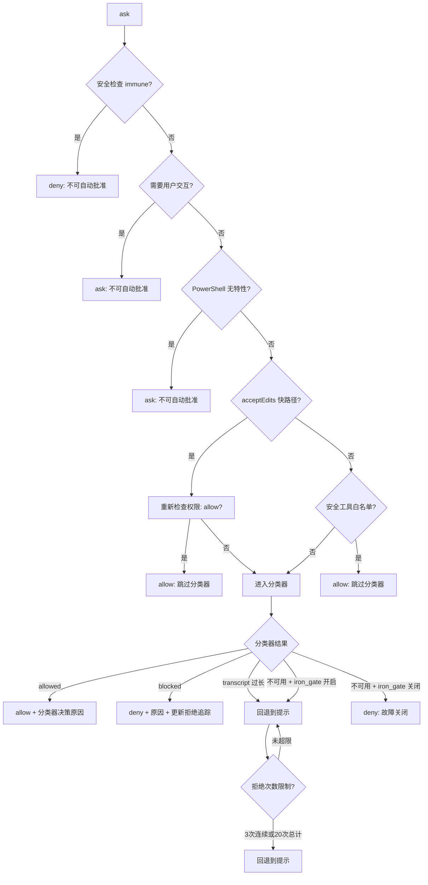
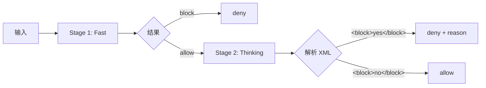

# 权限系统深度解析

> Claude Code 的权限系统是 Agent 安全运行的核心保障。本文从源码层面完整剖析权限决策的每一步逻辑。

## 1. 概述

权限系统决定了 Agent 执行每个工具调用时是否需要用户确认。这是一个多层防御系统，从规则匹配到 AI 分类器，再到4路竞争决策架构。

```
工具调用请求
  → 规则检查 (deny/ask/allow rules)
  → 模式决策 (bypass/auto/default)
  → AI 分类器 (auto 模式)
  → 4路竞争决策 (用户/CCR/Channel/Hooks)
  → 最终结果: allow / deny
```

## 2. 权限模式

| 模式 | 行为 | 场景 |
|------|------|------|
| `default` | 每次需要权限的操作都询问用户 | 交互式使用 |
| `auto` | AI 分类器自动决策，高置信度时自动放行 | 高效开发 |
| `bypassPermissions` | 跳过所有权限检查（规则检查仍执行） | CI/CD |
| `plan` | 规划模式下等同于 bypass | 规划阶段 |
| `dontAsk` | 将所有 'ask' 转为 'deny' | 非交互式 |

## 3. 核心决策管线：hasPermissionsToUseTool

```typescript
// src/utils/permissions/permissions.ts (~1486 行)
function hasPermissionsToUseTool(
  tool: Tool,
  input: ToolInput,
  context: ToolPermissionContext,
): 'allow' | 'deny' | 'ask'
```

### 3.1 Step 1: 规则检查（所有模式都执行）

即使 `bypassPermissions` 模式，这些规则检查仍然强制执行：

```
1a. 整个工具被 deny 规则匹配 → deny
1b. 整个工具有 ask 规则 → ask (沙箱 Bash 例外)
1c. 工具自身的 checkPermissions() → toolPermissionResult
1d. 工具实现返回 denied → deny
1e. 工具需要用户交互 (AskUserQuestion, ExitPlanMode, ReviewArtifact) → ask
    即使 bypass 模式也必须 ask
1f. 内容级别的 ask 规则 (如 Bash("npm publish:*")) → ask
    即使 bypass 模式也必须 ask
1g. 安全检查 (.git/, .claude/, .vscode/, shell 配置文件) → ask
    即使 bypass 模式也必须 ask
```

**关键设计理念**：`bypass` 不是无限制的——危险路径和需要用户交互的工具始终需要确认。

### 3.2 Step 2: 模式决策

```
2a. bypassPermissions (或 plan 模式 + bypass 可用) → allow
    (Step 1a-1g 仍然被尊重)
2b. 整个工具被 allow 规则匹配 → allow
```

### 3.3 Step 3: passthrough 转 ask

如果工具的 `checkPermissions` 返回 `passthrough`，转为 `ask`。

### 3.4 Step 4: 模式特定变换（仅 result === 'ask' 时）

#### dontAsk 模式
```
ask → deny (附带 DONT_ASK_REJECT_MESSAGE)
```

#### auto 模式（最复杂）



**安全工具白名单** (`SAFE_YOLO_ALLOWLISTED_TOOLS`，`src/utils/permissions/classifierDecision.ts:56-93`）：
- 只读文件操作：Read, Grep, Glob, LSP, ToolSearch, ListMcpResources, ReadMcpResource
- 任务/计划 UI：TodoWrite, TaskCreate/Get/Update/List/Stop/Output, AskUserQuestion, EnterPlanMode, ExitPlanMode
- Swarm 协调（仅内部邮箱/团队状态）：TeamCreate, TeamDelete, SendMessage
- 其他：Sleep, Workflow（门控）, TerminalCapture/OverflowTest（ant 门控）

注意：**不含** write/edit 工具——写操作走 acceptEdits 快路径（工作目录内 allow，目录外进分类器）。这些工具天生安全，直接跳过分类器。

## 4. AI 分类器 (Yolo Classifier)

### 4.1 分类器架构

```typescript
// src/utils/permissions/yoloClassifier.ts (~1495 行)
```

系统提供了两种分类器实现：

#### 路径 A: Tool-use 分类器（默认）

```
系统提示 = BASE_PROMPT + 权限模板 + 用户 allow/deny/environment 规则
对话转录 = 用户文本消息 + 助手 tool_use 块 (JSONL 或文本格式)
↓
调用 LLM with classify_result tool (tool_choice 强制输出)
↓
结构化 JSON 输出: { thinking, shouldBlock, reason }
```

#### 路径 B: XML 两阶段分类器



- **Stage 1 (fast)**: `max_tokens=64`, `stop_sequences=['</block>']`, 快速判断
- **Stage 2 (thinking)**: `max_tokens=4096`, 链式思考，精确决策
- 模式: `'both'`(默认) / `'fast'` / `'thinking'`

### 4.2 模型选择优先级

```
CLAUDE_CODE_AUTO_MODE_MODEL 环境变量
  > GrowthBook 配置
  > 主循环模型
```

### 4.3 拒绝追踪

```typescript
interface DenialTrackingState {
  consecutiveDenials: number  // 连续拒绝次数
  totalDenials: number        // 总拒绝次数
}

// 3 次连续拒绝 或 20 次总拒绝 → 退出 auto 模式，回退到交互式确认
const CONSECUTIVE_DENIAL_LIMIT = 3
const TOTAL_DENIAL_LIMIT = 20
```

### 4.4 Iron Gate 机制

当分类器不可用时的故障策略：

| iron_gate 值 | 分类器不可用时 | 安全性 |
|-------------|--------------|--------|
| `closed` | deny（故障关闭） | 更安全 |
| `open` | 回退到交互式提示 | 更便利 |

## 5. 文件系统权限

### 5.1 读取权限检查 (8 步管线)

```typescript
// src/utils/permissions/filesystem.ts (~1777 行)
function checkReadPermissionForTool(path: string, context): PermissionResult {
  // (1) 阻止 UNC 路径 (\\server\share) - 纵深防御
  // (2) 检查可疑 Windows 路径模式
  // (3) 读取特定 deny 规则 (必须在 allow 之前！)
  // (4) 读取特定 ask 规则 (必须在隐式 allow 之前)
  // (5) 编辑权限隐含读取权限 (仅当无 read 特定 deny/ask)
  // (6) 允许工作目录内的读取
  // (7) 允许内部 harness 路径 (session-memory, plans, tool-results 等)
  // (8) 检查 read allow 规则
  // 默认: ask
}
```

### 5.2 写入权限检查 (5 步管线)

```typescript
function checkWritePermissionForTool(path: string, context): PermissionResult {
  // (1) Deny 规则
  // (1.5) 内部可编辑路径 (plan files, scratchpad, agent-memory 等)
  // (1.6) .claude/** 会话级 allow 规则 (范围限定的绕过)
  // (1.7) 综合安全验证 (Windows 模式, Claude 配置, 危险文件)
  //       必须在 allow 规则之前！
  //       .claude/skills/{name}/ → 缩窄的会话范围建议
  // (2) Ask 规则
  // (3) acceptEdits 模式允许工作目录写入
  // (4) Allow 规则
  // (5) 默认: ask + 建议生成
}
```

### 5.3 危险文件/目录列表

```typescript
const DANGEROUS_FILES = [
  '.gitconfig', '.gitmodules',   // Git 配置
  '.bashrc', '.bash_profile',    // Shell 初始化
  '.zshrc', '.zprofile', '.profile',  // Shell 初始化
  '.ripgreprc',                   // Ripgrep 配置
  '.mcp.json', '.claude.json',   // Claude 自身配置
]

const DANGEROUS_DIRECTORIES = [
  '.git',     // 版本控制
  '.vscode',  // IDE 配置
  '.idea',    // IDE 配置
  '.claude',  // Claude 配置 (worktrees 子目录例外)
]
```

### 5.4 Windows 路径攻击面

系统检测以下可疑 Windows 路径模式：

| 攻击类型 | 示例 | 说明 |
|----------|------|------|
| NTFS ADS | `file.txt:stream` | 位置 2 后的冒号 |
| 8.3 短名 | `file~1.txt` | 波浪号 + 数字 |
| 长路径前缀 | `\\?\`, `\\.\` | 绕过路径限制 |
| 尾部点/空格 | `file. ` | 绕过文件名检查 |
| DOS 设备名 | `.CON`, `.PRN`, `.AUX`, `.NUL`, `.COM1-9`, `.LPT1-9` | 保留名称 |
| 三+连续点 | `...` | 路径遍历变种 |
| UNC 路径 | `\\server\share` | 网络路径 |

## 6. 4 路竞争决策架构

当权限决策需要用户确认时，系统启动4路竞争：

```typescript
// src/hooks/toolPermission/handlers/interactiveHandler.ts (~536 行)
```

```mermaid
flowchart TD
    A[权限请求] --> B[本地用户交互]
    A --> C[桥接器 CCR]
    A --> D[Channel 中继]
    A --> E[后台异步检查]

    B --> F{claim() 原子裁决}
    C --> F
    D --> F
    E --> F

    F --> G[最先响应者胜出]
```

### 6.1 本地用户交互

```typescript
// 排队等待用户确认
queueEntry = {
  onAbort,   // 取消回调
  onAllow,   // 允许回调
  onReject,  // 拒绝回调
  recheckPermission,  // 重新检查权限（处理模式切换）
}

// claim() 提供原子裁决：防止多个竞争者同时裁决
// 200ms 宽限期：防止意外按键取消分类器结果
```

### 6.2 桥接器 (CCR / claude.ai)

```typescript
// 向 Web UI 发送权限请求
// 双方竞争 —— 谁先响应谁赢（通过 claim()）
// CCR 可以返回 updatedInput 和 updatedPermissions
```

### 6.3 Channel 中继 (Telegram/iMessage 等)

```typescript
// 通过 MCP 通知发送到 IM 渠道
// Channel 回复是纯 yes/no（无 updatedInput）
// 即发即弃，优雅降级
```

### 6.4 后台异步检查

```typescript
// PermissionRequest hooks: 异步运行，可在用户响应前覆盖
// Bash 分类器 (BASH_CLASSIFIER 特性):
//   - allow: 显示 ✓ 1-3 秒后移除对话框
//   - dismiss (Esc): 取消计时器，移除队列条目
//   - 记录分类器批准类型（auto-mode vs prompt rule）
```

## 7. 权限规则管理

### 7.1 规则来源

```typescript
// 规则按来源分层，优先级从低到高：
type RuleSource =
  | 'user'           // ~/.claude/settings.json
  | 'project'        // .claude/settings.json
  | 'policy'         // 企业策略
  | 'flag'           // GrowthBook 特性标志
  | 'command'        // 命令行参数
```

### 7.2 规则匹配

```typescript
function toolMatchesRule(toolName: string, rulePattern: string): boolean {
  // 1. 直接工具名匹配: "Bash" 匹配 "Bash"
  // 2. MCP 服务器级匹配: "mcp__server1" 匹配 "mcp__server1__tool1"
  // 3. Agent 类型拒绝: "Agent(myAgent)" 匹配特定 agent 类型
}
```

### 7.3 规则操作

```typescript
// 增量应用（初始设置）
function applyPermissionRulesToPermissionContext(rules, context)

// 替换应用（设置变更时）
function syncPermissionRulesFromDisk(rules, context)
// 当 shouldAllowManagedPermissionRulesOnly() 时，先清除所有非策略来源

// 删除规则
function deletePermissionRule(rule, context)
// 从上下文 + 磁盘移除（policySettings/flagSettings/command 例外）
```

## 8. 特殊场景

### 8.1 PowerShell 拒绝指引

```typescript
// PowerShell 的独特安全风险：
const POWERSHELL_DENY_GUIDANCE = {
  download_and_execute: 'iwr|iex|curl|wget 模式',
  irreversible_destruction: 'Remove-Item -Recurse -Force C:\\',
  persistence: '注册表自启动、计划任务',
  elevation: 'Start-Process -Verb RunAs',
}
```

### 8.2 Swarm Worker 权限

```typescript
// src/hooks/toolPermission/handlers/swarmWorkerHandler.ts
// Worker Agent 的权限流程：
// 1. 分类器自动批准（如果安全）
// 2. 向 Leader 发送邮箱消息
// 3. Leader 代为请求用户确认
// 4. 回调注册等待结果
```

### 8.3 Coordinator 权限

```typescript
// src/hooks/toolPermission/handlers/coordinatorHandler.ts
// 协调器模式的权限流程：
// 1. 先运行 PermissionRequest hooks
// 2. 如果 BASH_CLASSIFIER 特性启用，运行 Bash 分类器
// 3. 都没有覆盖，回退到交互式处理
```

## 9. 如何为自己的 Agent 实现权限系统

### 9.1 最小权限系统

```typescript
type PermissionResult = 'allow' | 'deny' | 'ask'

function checkPermission(tool: string, input: any): PermissionResult {
  // 1. 检查硬编码的 deny 规则
  if (DENY_RULES.includes(tool)) return 'deny'

  // 2. 检查用户允许列表
  if (ALLOW_RULES.includes(tool)) return 'allow'

  // 3. 默认询问
  return 'ask'
}
```

### 9.2 生产级增强路径

| 增强项 | 复杂度 | 安全收益 |
|--------|--------|----------|
| 文件路径安全检查 | 中 | 防止路径遍历 |
| AI 分类器 | 高 | 减少用户中断 |
| 拒绝追踪 | 低 | 防止无限拒绝循环 |
| 多路竞争决策 | 高 | 多渠道响应 |
| 规则分层 | 中 | 企业/个人分离 |
| PowerShell 安全 | 低 | 平台特定风险 |
| Iron Gate 故障策略 | 低 | 分类器降级策略 |

## 10. 关键文件索引

| 文件 | 行数 | 功能 |
|------|------|------|
| `src/utils/permissions/permissions.ts` | ~1486 | 核心权限决策管线 |
| `src/utils/permissions/yoloClassifier.ts` | ~1495 | AI 自动分类器 |
| `src/utils/permissions/filesystem.ts` | ~1777 | 文件系统权限检查 |
| `src/hooks/toolPermission/handlers/interactiveHandler.ts` | ~536 | 4路竞争交互处理 |
| `src/hooks/toolPermission/handlers/coordinatorHandler.ts` | ~80 | 协调器权限处理 |
| `src/hooks/toolPermission/handlers/swarmWorkerHandler.ts` | ~120 | Swarm Worker 权限处理 |
| `src/Tool.ts` | ~800+ | ToolPermissionContext 和 ToolUseContext 类型定义 |
