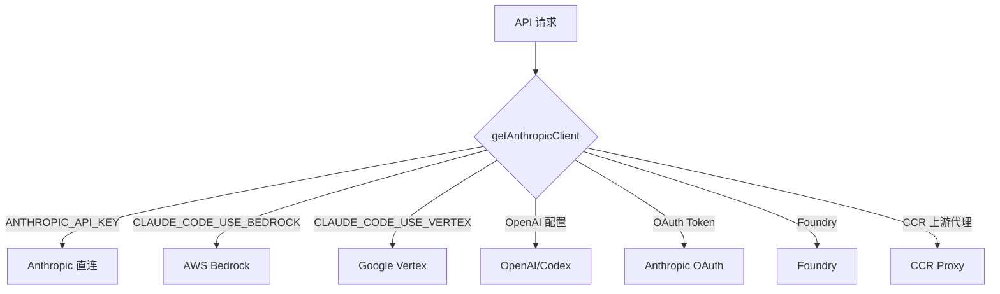

# Provider 路由与模型系统深度解析

> 本文详解 Claude Code 如何支持多个 LLM 提供商（Anthropic、AWS Bedrock、Google Vertex、OpenAI 等），以及模型选择、缓存控制、思考模式等机制。

## 1. Provider 路由架构



### 1.1 客户端初始化

```typescript
// src/services/api/client.ts:112（结构示意，真实为 async）
export async function getAnthropicClient({ apiKey } = {}) {
  // 按 if 分支顺序检查（client.ts:187-340）：
  if (isEnvTruthy(process.env.CLAUDE_CODE_USE_BEDROCK)) {
    const { AnthropicBedrock } = await import('@anthropic-ai/bedrock-sdk')
    // AWS 凭证走 aws-sdk 默认链；region 支持 AWS_REGION/AWS_DEFAULT_REGION
    return new AnthropicBedrock(bedrockArgs)
  }
  if (isEnvTruthy(process.env.CLAUDE_CODE_USE_FOUNDRY)) {
    // Foundry（Azure）：ANTHROPIC_FOUNDRY_RESOURCE 或 ANTHROPIC_FOUNDRY_BASE_URL
    // 认证：ANTHROPIC_FOUNDRY_API_KEY 或 Azure AD DefaultAzureCredential
  }
  if (isEnvTruthy(process.env.CLAUDE_CODE_USE_VERTEX)) {
    const [{ AnthropicVertex }, { GoogleAuth }] = await Promise.all([...])
    // 项目：ANTHROPIC_VERTEX_PROJECT_ID；区域支持模型级 VERTEX_REGION_* 变量
    return new AnthropicVertex(vertexArgs)
  }
  // OpenAI Responses 模型 → OpenAI 兼容路径
  // OAuth（Claude.ai 订阅）→ baseURL 取自 OAuth config
  // 默认：new Anthropic({ apiKey: resolveAnthropicClientApiKey(...) })
}
```

### 1.2 Provider 检测优先级（`client.ts:187-340`）

```
1. CLAUDE_CODE_USE_BEDROCK=1    → Bedrock
2. CLAUDE_CODE_USE_FOUNDRY=1    → Foundry (Azure)
3. CLAUDE_CODE_USE_VERTEX=1     → Vertex
4. OpenAI Responses 模型配置    → OpenAI 兼容路径
5. ANTHROPIC_AUTH_TOKEN / OAuth → Anthropic OAuth（Claude.ai 订阅）
6. ANTHROPIC_API_KEY / apiKeyHelper → Anthropic 直连
```

## 2. 模型选择与解析

### 2.1 模型别名系统

别名是**枚举集合**而非"别名→具体 ID"的静态映射——解析在运行时根据当前默认模型动态进行（`src/utils/model/aliases.ts:1-7`、`model.ts:488-502`）：

```typescript
export const MODEL_ALIASES = [
  'sonnet',
  'opus',
  'haiku',
  'best',
  'sonnet[1m]',
  'opus[1m]',
  'opusplan',
] as const

// 解析规则（model.ts:488）：
// 'opusplan'  → Sonnet 默认（plan 模式时切 Opus）
// 'sonnet'    → getDefaultSonnetModel()   // 当前为 sonnet-4-6
// 'haiku'     → getDefaultHaikuModel()
// 'opus'      → getDefaultOpusModel()     // 当前为 claude-opus-4-7
// 'best'      → getBestModel()
// '[1m]' 后缀 → 解析后追加 1M 上下文标记
```

### 2.2 模型选择链

```
命令行 --model 参数
  > 会话中的 /model 命令
  > 环境变量 ANTHROPIC_MODEL
  > 用户设置中的默认模型
  > 项目设置中的默认模型
  > 产品默认模型 (Sonnet 4.6)
```

### 2.3 模型迁移

```typescript
// src/migrations/ 目录下的迁移（12 个文件），模型相关包括：
migrateFennecToOpus.ts       // Fennec → Opus 重命名
migrateLegacyOpusToCurrent.ts  // 旧 Opus → 当前 Opus
migrateOpusToOpus1m.ts       // Opus → Opus 1M
migrateSonnet1mToSonnet45.ts // Sonnet[1m] → pin 到 4.5 版本
migrateSonnet45ToSonnet46.ts // Sonnet 4.5 → 4.6
// 其余为设置迁移：autoUpdates、bypassPermissions、mcpServers 等

// 每个迁移：
// 1. 检查全局 config 中的完成标记
// 2. 读取特定设置来源
// 3. 更新模型名称
// 4. 保存完成标记
```

## 3. 思考模式 (Thinking)

### 3.1 Thinking 配置

```typescript
type ThinkingConfig =
  | { type: 'disabled' }                          // 禁用思考
  | { type: 'enabled', budget_tokens: number }     // 启用，指定 token 预算
  | { type: 'auto' }                               // 自动决定

// 思考配置的解析：
function resolveThinkingConfig(
  thinking: number | false | undefined,
  maxTokens: number,
): ThinkingConfig {
  if (thinking === false) return { type: 'disabled' }
  if (typeof thinking === 'number') {
    return {
      type: 'enabled',
      budget_tokens: Math.min(thinking, maxTokens - 1),
    }
  }
  // undefined: 透传，使用服务器默认值
  return undefined
}
```

### 3.2 alwaysOnThinking 模型

某些模型始终启用思考模式（不支持 `thinking: false`）：

```typescript
// 对 alwaysOnThinking 模型：
// - 不发送 thinking: false（会返回 400 错误）
// - 代替：在 max_tokens 中增加 2048 余量
// - 确保预算足够
```

### 3.3 用户控制

在 REPL 中，`Meta+T`（绑定 `chat:thinkingToggle`，`defaultBindings.ts:72`）打开思考模式选择器。注意：当前选择器是**开/关**二选（`src/components/ThinkingToggle.tsx`：Enabled/Disabled），没有 low/medium/high 三档循环：

```
Meta+T → ThinkingToggle 选择器
  Enabled  (Claude will think before responding)
  Disabled (Claude will respond without extended thinking)
```

CLI 侧还提供 `--thinking <enabled|adaptive|disabled>` 与（已废弃的）`--max-thinking-tokens`（`src/main.tsx`）。

## 4. 缓存控制

### 4.1 Prompt Cache 机制

Anthropic API 支持 prompt caching，对重复内容（系统提示、工具定义）进行缓存，减少输入 token 计费：

```typescript
// 在 API 请求中标记可缓存的 content blocks
{
  type: 'text',
  text: systemPrompt,
  cache_control: { type: 'ephemeral' }  // 标记为可缓存
}
```

### 4.2 缓存策略

```typescript
// 缓存 allowlist 管理
const promptCache1hAllowlist: string[]  // 1小时缓存白名单

// 缓存 eligible 判断
function isEligibleForCache(block: ContentBlock): boolean {
  // 只有大块内容（>1024 tokens）才值得缓存
  // 系统提示和工具定义始终标记为可缓存
  // 用户消息按需标记
}
```

### 4.3 缓存编辑

```typescript
// 当缓存编辑模式启用时
// 系统在请求头中添加标记
// 允许对已缓存内容进行增量修改
cacheEditingHeaderLatched: boolean
```

## 5. API 请求构建

### 5.1 消息准备管线

```typescript
// src/utils/messages.ts (~5512 行)
function prepareMessagesForApi(
  messages: Message[],
  options: PrepareOptions,
): MessageParam[] {
  return messages
    .map(normalizeMessage)           // 规范化消息格式
    .filter(isNotEmptyMessage)       // 过滤空消息
    .map(attachCacheControl)         // 附加缓存控制标记
    .map(convertAttachments)         // 转换附件（图片、PDF）
    .map(truncateIfNeeded)           // 超长内容截断
    .map(addSystemPrompt)            // 添加系统提示段
}
```

### 5.2 附件转换

```typescript
// 图片附件
imageAttachment → {
  type: 'image',
  source: {
    type: 'base64',
    media_type: detectMimeType(attachment),
    data: readBase64(attachment),
  }
}

// PDF 附件
pdfAttachment → {
  type: 'document',
  source: {
    type: 'base64',
    media_type: 'application/pdf',
    data: readBase64(attachment),
  }
}
```

### 5.3 媒体限制

```typescript
// src/constants/apiLimits.ts
const IMAGE_MAX_BASE64_SIZE = 5 * 1024 * 1024     // 5MB (3.75MB 原始)
const IMAGE_MAX_DIMENSION = 2000                    // 2000x2000px
const PDF_MAX_RAW_SIZE = 20 * 1024 * 1024          // 20MB
const PDF_MAX_PAGES = 100
const PDF_MAX_EXTRACT_THRESHOLD = 3 * 1024 * 1024  // 3MB
const PDF_MAX_EXTRACT_SIZE = 100 * 1024 * 1024     // 100MB
const MAX_MEDIA_ITEMS = 100                         // 每次请求
```

## 6. API 调用重试与容错

### 6.1 重试策略

```typescript
// src/services/api/claude.ts
const retryConfig = {
  maxRetries: 3,
  backoff: exponentialBackoff,  // 指数退避
  retryableErrors: [
    'rate_limit_error',       // 429 限速
    'api_error',              // 500 服务器错误
    'overloaded_error',       // 529 过载
    'timeout_error',          // 超时
  ],
  nonRetryableErrors: [
    'invalid_request_error',  // 400 请求错误
    'authentication_error',   // 401 认证错误
    'permission_error',       // 403 权限错误
    'not_found_error',        // 404 未找到
  ],
}
```

### 6.2 非流式降级

```typescript
// 如果流式请求失败，降级到非流式请求
async function createWithFallback(params) {
  try {
    return await client.messages.create({ ...params, stream: true })
  } catch (streamError) {
    if (isStreamIncompatibleError(streamError)) {
      // 降级到非流式
      return await client.messages.create({ ...params, stream: false })
    }
    throw streamError
  }
}
```

### 6.3 资源泄漏防护

```typescript
// 确保流式响应被完全消费或显式中止
// 防止连接泄漏
finally {
  if (stream && !stream.done) {
    await stream.abort()
  }
}
```

## 7. 归因头 (Attribution Header)

每个 API 请求都携带归因头，用于 Anthropic 统计使用情况：

```typescript
// src/constants/system.ts
function getAttributionHeader(): string {
  return [
    `v=${MACRO.VERSION}`,           // 版本
    `fp=${getFingerprint()}`,        // 指纹
    `ep=${getEntrypoint()}`,         // 入口类型
    `cch=00000`,                     // 原生客户端认证占位
    `wl=${getWorkloadHint()}`,       // 工作负载提示
  ].join(',')
}
```

## 8. SideQuery 旁路查询

### 8.1 用途

旁路查询独立于主循环，用于内部决策：

| 用途 | 模型 | 说明 |
|------|------|------|
| Auto 模式分类器 | 可配置 | 判断工具调用是否安全 |
| 权限解释器 | 小模型 | 向用户解释权限原因 |
| 会话搜索 | 小模型 | 在历史中搜索相关内容 |
| 模型验证 | 小模型 | 验证 API Key 有效性 |

### 8.2 配置

```typescript
// src/utils/sideQuery.ts
type SideQueryOptions = {
  model?: string                          // 默认使用分类器模型
  system?: string | TextBlockParam[]      // 系统提示
  messages: MessageParam[]                // 消息
  tools?: ToolParam[]                     // 工具
  tool_choice?: ToolChoice                // 工具选择策略
  max_tokens?: number                     // 默认 1024
  maxRetries?: number                     // 默认 2
  temperature?: number                    // 温度
  thinking?: number | false               // 思考配置
  stop_sequences?: string[]               // 停止序列
  querySource?: string                    // 遥测来源标记
}
```

## 9. 成本追踪

### 9.1 成本计算

```typescript
// src/cost-tracker.ts (381 行)
// 从 bootstrap state 读取计数器
getTotalCostUSD()       // 总成本 (USD)
getModelUsage()         // 按模型的使用量
getTotalInputTokens()   // 总输入 token
getTotalOutputTokens()  // 总输出 token

// 按模型计算成本
calculateUSDCost(model, inputTokens, outputTokens) → number
```

### 9.2 使用快照

```typescript
type SessionUsageSnapshot = {
  models: {
    model: string
    displayName: string
    inputTokens: number
    outputTokens: number
    cacheCreationTokens: number
    cacheReadTokens: number
    costUSD: number
    contextWindow: number
    maxOutputTokens: number
  }[]
  totalCostUSD: number
  totalInputTokens: number
  totalOutputTokens: number
}
```

### 9.3 会话恢复

```typescript
// 保存当前会话成本到项目配置
saveCurrentSessionCosts()

// 恢复会话时读取
restoreCostStateForSession()

// 会话间重置
resetCostState()
```

## 10. 如何为自己的 Agent 接入多 Provider

### 10.1 最小实现

```typescript
function getClient(provider: string): LLMClient {
  switch (provider) {
    case 'openai':    return new OpenAI(apiKey)
    case 'anthropic': return new Anthropic(apiKey)
    case 'bedrock':   return new BedrockClient(awsConfig)
    default:          throw new Error(`Unknown provider: ${provider}`)
  }
}
```

### 10.2 生产级增强

| 增强项 | 作用 | 复杂度 |
|--------|------|--------|
| Provider 自动检测 | 零配置使用 | 低 |
| OAuth 认证 | 无需 API Key | 高 |
| Prompt Cache | 降低成本 | 中 |
| 流式降级 | 兼容性 | 低 |
| 归因头 | 使用统计 | 低 |
| 模型别名 | 用户体验 | 低 |
| 模型迁移 | 平滑升级 | 低 |
| 成本追踪 | 成本控制 | 中 |
| mTLS | 企业安全 | 高 |

## 11. 关键文件索引

| 文件 | 行数 | 功能 |
|------|------|------|
| `src/services/api/claude.ts` | ~3489 | API 流式调用、重试、缓存控制 |
| `src/services/api/client.ts` | - | 客户端初始化和 provider 路由 |
| `src/utils/sideQuery.ts` | 236 | 旁路查询 |
| `src/utils/messages.ts` | ~5512 | 消息准备管线 |
| `src/cost-tracker.ts` | 381 | 成本追踪 |
| `src/costHook.ts` | 22 | 成本 React hook |
| `src/utils/modelCost.ts` | - | 模型成本计算 |
| `src/constants/apiLimits.ts` | - | API 限制常量 |
| `src/constants/system.ts` | - | 系统提示前缀和归因头 |
| `src/migrations/` | 12 files | 模型/设置迁移 |
