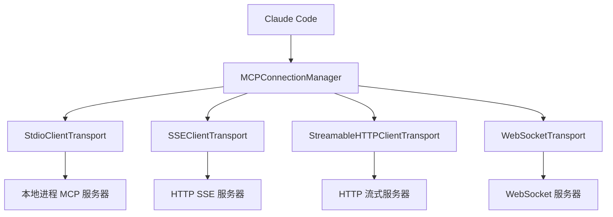
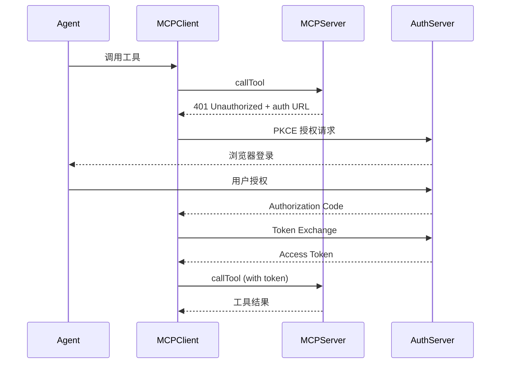

# MCP 服务与 Skills 系统深度解析

> 本文详解 Model Context Protocol 集成机制和 Skills 扩展系统——Agent 如何连接外部世界和加载自定义能力。

## 1. MCP (Model Context Protocol) 集成

### 1.1 架构概述

MCP 是 Anthropic 定义的标准协议，允许 LLM 应用连接外部数据源和工具。Claude Code 实现了完整的 MCP 客户端，支持 4 种传输类型。



### 1.2 连接管理器

```typescript
// src/services/mcp/MCPConnectionManager.tsx
class MCPConnectionManager {
  // 管理所有 MCP 服务器连接的生命周期
  private connections: Map<string, MCPConnection> = new Map()

  async connectAll(servers: McpServerConfig[]): Promise<void> {
    // 并行连接所有配置的 MCP 服务器
    await Promise.allSettled(
      servers.map(config => this.connect(config))
    )
  }

  async connect(config: McpServerConfig): Promise<MCPConnection> {
    const transport = this.createTransport(config)
    const client = new Client({
      name: 'claude-code',
      version: MACRO.VERSION,
    })

    await client.connect(transport)

    // 发现工具、命令和资源
    const [tools, commands, resources] = await Promise.all([
      client.listTools(),
      client.listCommands(),
      client.listResources(),
    ])

    const connection: MCPConnection = {
      config,
      client,
      transport,
      tools,
      commands,
      resources,
      status: 'connected',
    }

    this.connections.set(config.name, connection)
    return connection
  }
}
```

### 1.3 四种传输类型

#### StdioClientTransport (最常用)

```typescript
// 启动子进程，通过 stdin/stdout 通信
const transport = new StdioClientTransport({
  command: config.command,      // 如 "npx", "python"
  args: config.args,            // 如 ["-y", "@anthropic/mcp-server"]
  env: { ...process.env, ...config.env },
  stderr: 'pipe',               // 捕获 stderr 用于诊断
})
```

#### SSEClientTransport

```typescript
// 通过 HTTP Server-Sent Events 连接
const transport = new SSEClientTransport(
  new URL(config.url)  // 如 "http://localhost:3000/sse"
)
```

#### StreamableHTTPClientTransport

```typescript
// HTTP 流式传输（支持双向流）
const transport = new StreamableHTTPClientTransport(
  new URL(config.url)
)
```

#### WebSocketTransport

```typescript
// WebSocket 连接
const transport = new WebSocketTransport(
  new URL(config.url)  // 如 "ws://localhost:3000/ws"
)
```

### 1.4 MCP 工具注册

```typescript
// src/services/mcp/client.ts (~1000+ 行)

// MCP 服务器的工具被包装为 MCPTool
class MCPTool implements Tool {
  name: string           // 格式: mcp__{serverName}__{toolName}
  description: string    // 来自 MCP 服务器的描述
  input_schema: object   // 来自 MCP 服务器的 JSON Schema

  constructor(
    private serverName: string,
    private mcpTool: McpServerTool,
  ) {
    this.name = `mcp__${serverName}__${mcpTool.name}`
    this.description = mcpTool.description
    this.input_schema = mcpTool.inputSchema
  }

  async call(input: ToolInput, context: ToolUseContext) {
    const client = getMcpClient(this.serverName)

    // 调用 MCP 工具
    const result = await client.callTool({
      name: this.mcpTool.name,
      arguments: input,
    })

    return formatToolResult(result)
  }
}
```

### 1.5 OAuth 认证流程



### 1.6 ElicitRequest 处理

MCP 服务器可以主动向用户请求信息（Elicitation）：

```typescript
// MCP 服务器发送 ElicitRequest
// Claude Code 弹出 ElicitationDialog 收集用户输入
// 结果返回给 MCP 服务器

handleElicitation?: (
  serverName: string,
  url: string,
  message: string,
  schema: object,
) => Promise<ElicitationResult>
```

### 1.7 MCP 资源管理

```typescript
// 列出可用资源
const resources = await client.listResources()

// 读取特定资源
const content = await client.readResource({ uri: resource.uri })

// 通过 ReadMcpResourceTool 向 Agent 暴露
// 通过 ListMcpResourcesTool 列出可用资源
```

### 1.8 MCP Host 预检查

```typescript
// src/server/services/mcpHostPreflight.ts (166 行)
// 在启动 MCP 服务器前检查命令是否可用

function preflightCheck(config: McpServerConfig): PreflightResult {
  // 1. 解析命令路径（PATH 或绝对路径）
  // 2. Windows PATHEXT 处理
  // 3. 提供运行时特定提示：
  //    - Node.js: "npm install -g node"
  //    - Python: "pip install python"
  //    - uv: "pip install uv"
  //    - Bun: "curl -fsSL https://bun.sh/install | bash"
}
```

## 2. Skills 系统

### 2.1 架构概述

Skills 是一种声明式的 Agent 能力扩展机制。一个 Skill 是一个 Markdown 文件，包含 frontmatter 元数据和指令内容。

```
.claude/skills/
  ├── my-skill/
  │   ├── SKILL.md          # Skill 定义（frontmatter + 内容）
  │   └── references/       # 可选：参考文件（按需加载）
  ├── code-review.md        # 单文件 Skill
  └── testing-guide.md
```

### 2.2 Skill Frontmatter（真实字段，`src/skills/loadSkillsDir.ts:197-260`）

```yaml
---
name: code-review
description: 执行代码审查，检查安全、性能和可维护性问题
when_to_use: 当用户要求审查代码、PR 或提交时
allowed-tools: Bash, Read, Grep, Glob   # 可选：限制 Skill 执行期的可用工具
model: opus                             # 可选：指定模型（别名或完整 ID）
argument-hint: "[files]"                # 可选：/命令 参数提示
disable-model-invocation: false         # 可选：禁止模型经 SkillTool 主动调用
context: fork                           # 可选：fork 上下文执行
---

# 代码审查 Skill

你是一个专业的代码审查专家。请按照以下步骤进行审查：

1. **安全性检查**: ...
2. **性能检查**: ...
3. **可维护性检查**: ...
```

> 注意：没有 `triggers`/`kind` 字段。`when_to_use` 供 SkillTool 的模型侧匹配，用户侧入口是 `/skill-name` 命令。hooks 也可以通过 frontmatter 声明（HooksSchema 解析，`loadSkillsDir.ts:133`）。

### 2.3 Skill 加载

```typescript
// src/skills/loadSkillsDir.ts (1086 行)

// Skill 来源（优先级从低到高）：
// 1. 内置 Skills (bundled)
// 2. 用户全局 Skills (~/.claude/skills/)
// 3. 项目 Skills (.claude/skills/)
// 4. 插件 Skills
// 5. 托管 Skills (企业策略)

function loadSkills(cwd: string): Skill[] {
  const skills: Skill[] = []

  // 1. 内置 Skills
  skills.push(...loadBundledSkills())

  // 2. 用户全局 Skills
  const userSkillsDir = path.join(getClaudeDir(), 'skills')
  skills.push(...loadSkillsFromDir(userSkillsDir))

  // 3. 项目 Skills
  const projectSkillsDir = path.join(cwd, '.claude', 'skills')
  skills.push(...loadSkillsFromDir(projectSkillsDir))

  // 4. 插件 Skills
  skills.push(...loadPluginSkills())

  // 5. 托管 Skills
  if (isManagedSettingsEnabled()) {
    skills.push(...loadManagedSkills())
  }

  return deduplicateSkills(skills)  // 后加载的覆盖先加载的
}

function loadSkillsFromDir(dir: string): Skill[] {
  if (!fs.existsSync(dir)) return []

  const skills: Skill[] = []
  const entries = fs.readdirSync(dir, { recursive: true })

  for (const entry of entries) {
    if (entry.endsWith('.md')) {
      const content = fs.readFileSync(path.join(dir, entry), 'utf-8')
      const skill = parseSkillMarkdown(content, entry)
      if (skill) skills.push(skill)
    }
  }

  return skills
}
```

### 2.4 Skill 解析

真实解析产出（`loadSkillsDir.ts:197-260`）：

```typescript
// 关键字段（真实集合）
{
  name: frontmatter.name,
  description: frontmatter.description ?? '',
  whenToUse: frontmatter.when_to_use,       // 模型侧匹配依据
  allowedTools: parseAllowedTools(frontmatter), // allowed-tools
  model: frontmatter.model,
  disableModelInvocation: parseBooleanFrontmatter(...),
  hooks: parseSkillHooks(frontmatter),      // HooksSchema 校验
  paths: parseSkillPaths(frontmatter),      // CLAUDE.md 风格路径规则
  content: body,                            // Markdown 正文（调用时才完整加载）
  source: detectSource(filePath),           // 'user' | 'project' | 'plugin' | 'managed'
  filePath,
}
```

性能优化：启动时只解析 frontmatter 估算 token（`loadSkillsDir.ts:97-104`），正文延迟到首次调用时加载。

### 2.5 Skill 执行

Skill 通过 SkillTool（工具名 `Skill`，`src/tools/SkillTool/SkillTool.ts:331`）向 Agent 暴露。没有 `kind: command` 执行 shell 脚本的分支——Skill 只有"内容注入"一种执行语义：

```typescript
// src/tools/SkillTool/SkillTool.ts（结构示意）
const SkillTool = buildTool({
  name: SKILL_TOOL_NAME,        // 'Skill'（SkillTool/constants.ts）
  // input: skill 名 + 参数
  // call():
  //   1. 按名字查找 Skill（含 discoveredSkillNames/官方市场/插件来源分流）
  //   2. 加载 Skill 正文（延迟加载，见 2.4）
  //   3. 把正文（替换 $ARGUMENTS 等占位符）作为工具结果注入对话
  //      → 模型按 Skill 指令，通过受限工具集（allowed-tools）继续执行
  //   4. 遥测记录 command_name / plugin_name 等
})
```

Skill 指定的 `model` 影响该 Skill 执行时的模型选择，`context: fork` 则在 fork 的子上下文中运行。

### 2.6 MCP Skill Builder

MCP 工具可以自动构建为 Skills：

```typescript
// src/skills/mcpSkillBuilders.ts
// 将 MCP 服务器的工具集转换为可用的 Skill

function buildSkillsFromMcpServer(
  serverName: string,
  tools: McpTool[],
): Skill[] {
  return tools.map(tool => ({
    name: `mcp__${serverName}__${tool.name}`,
    description: tool.description,
    content: `Use the ${tool.name} tool from ${serverName} MCP server.`,
    kind: 'prompt',
    tools: [tool.name],
    source: 'mcp',
  }))
}
```

## 3. MCP Server 模式

Claude Code 自身也可以作为 MCP 服务器运行：

```typescript
// src/entrypoints/mcp.ts (196 行)
// 使用 --mcp 标志启动

const server = new Server({
  name: 'claude/tengu',
  version: MACRO.VERSION,
})

// 注册 ListTools 处理器
server.setRequestHandler(ListToolsRequestSchema, async () => {
  const tools = getTools(permissionContext)
  return {
    tools: tools.map(tool => ({
      name: tool.name,
      description: tool.description,
      inputSchema: tool.input_schema,
      // 输出 schema 要求根级 type: "object"
      outputSchema: tool.output_schema ?? { type: 'object' },
    }))
  }
})

// 注册 CallTool 处理器
server.setRequestHandler(CallToolRequestSchema, async (request) => {
  const tool = tools.find(t => t.name === request.params.name)
  const result = await tool.call(request.params.arguments, context)
  return { content: [{ type: 'text', text: result.content }] }
})

// 使用 StdioServerTransport
const transport = new StdioServerTransport()
await server.connect(transport)
```

**特点：**
- 将所有 CLI 工具暴露为 MCP 工具
- LRU 缓存（100 文件，25MB）用于 readFileState
- 仅暴露 `/review` 命令
- 创建最小化 ToolUseContext（无 MCP 客户端、无思考、非交互）

## 4. Agent SDK

### 4.1 公共 API 表面

```typescript
// src/entrypoints/agentSdkTypes.ts (443 行)

// V1 API
export function query(params: QueryParams): Promise<QueryResult>

// V2 API (unstable)
export function unstable_v2_createSession(config): Session
export function unstable_v2_resumeSession(sessionId): Session
export function unstable_v2_prompt(session, message): Promise<Response>

// 会话管理
export function getSessionMessages(sessionId): Message[]
export function listSessions(): SessionInfo[]
export function renameSession(sessionId, name): void
export function tagSession(sessionId, tag): void
export function forkSession(sessionId): string

// 工具注册
export function tool(definition: ToolDefinition): void

// MCP 服务器创建
export function createSdkMcpServer(config): McpServer

// 调度任务
export function watchScheduledTasks(handler): void

// 远程控制
export function connectRemoteControl(config): RemoteControl
```

> **注意**：此仓库中的 SDK 实现都是 "not implemented" 桩——真实代码在 ant-internal 中。

### 4.2 Hook 事件类型

```typescript
// src/entrypoints/sdk/coreTypes.ts:25-53（完整列表，27 个）
const HOOK_EVENTS = [
  'PreToolUse', 'PostToolUse', 'PostToolUseFailure',
  'Notification', 'UserPromptSubmit',
  'SessionStart', 'SessionEnd', 'Stop', 'StopFailure',
  'SubagentStart', 'SubagentStop',
  'PreCompact', 'PostCompact',
  'PermissionRequest', 'PermissionDenied',
  'Setup', 'TeammateIdle',
  'TaskCreated', 'TaskCompleted',
  'Elicitation', 'ElicitationResult',
  'ConfigChange',
  'WorktreeCreate', 'WorktreeRemove',
  'InstructionsLoaded', 'CwdChanged', 'FileChanged',
] as const  // 27 个事件类型
```

## 5. 插件系统

### 5.1 插件结构

```
~/.claude/plugins/
  └── my-plugin/
      ├── manifest.json     # 插件元数据
      ├── skills/           # Skill 文件
      ├── mcp/              # MCP 服务器配置
      ├── hooks/            # 钩子脚本
      ├── commands/         # 自定义命令
      └── lsp/              # LSP 服务器配置
```

### 5.2 插件生命周期

```
1. 发现: 扫描插件目录
2. 加载: 解析 manifest.json
3. 注册:
   - Skills → loadPluginSkills()
   - MCP 服务器 → startPluginMcpServers()
   - Hooks → registerPluginHooks()
   - Commands → registerPluginCommands()
   - LSP → startPluginLspServers()
4. 运行: 正常运行期间
5. 卸载: 停止 MCP/LSP 服务器，注销钩子
```

## 6. 如何为自己的 Agent 实现扩展系统

### 6.1 最小 MCP 客户端

```typescript
async function connectMcpServer(config) {
  const transport = new StdioClientTransport({
    command: config.command,
    args: config.args,
  })

  const client = new MCPClient()
  await client.connect(transport)

  const tools = await client.listTools()
  return { client, tools }
}
```

### 6.2 最小 Skill 系统

```typescript
function loadSkill(filePath: string): Skill {
  const content = fs.readFileSync(filePath, 'utf-8')
  const { attributes, body } = parseFrontMatter(content)
  return { name: attributes.name, instructions: body }
}
```

### 6.3 生产级增强路径

| 增强项 | 作用 | 复杂度 |
|--------|------|--------|
| 多传输类型 | 连接不同类型的服务器 | 中 |
| OAuth 认证 | 安全认证 MCP 服务器 | 高 |
| Elicitation | 服务器向用户请求信息 | 中 |
| Skill 去重 | 多来源优先级处理 | 低 |
| 插件市场 | 动态安装/卸载 | 高 |
| MCP Server 模式 | 自身作为服务器暴露 | 中 |
| SDK API | 程序化控制 Agent | 高 |
| Hook 事件系统 | 可观测性和自定义逻辑 | 中 |

## 7. 关键文件索引

| 文件 | 行数 | 功能 |
|------|------|------|
| `src/services/mcp/client.ts` | ~1000+ | MCP 客户端核心 |
| `src/services/mcp/types.ts` | - | MCP 类型定义 |
| `src/services/mcp/MCPConnectionManager.tsx` | - | 连接生命周期管理 |
| `src/skills/loadSkillsDir.ts` | 1086 | Skill 加载和解析 |
| `src/skills/mcpSkillBuilders.ts` | - | MCP→Skill 转换 |
| `src/skills/mcpSkills.ts` | - | MCP Skills (stub) |
| `src/entrypoints/mcp.ts` | 196 | MCP Server 模式 |
| `src/entrypoints/agentSdkTypes.ts` | 443 | Agent SDK API 表面 |
| `src/entrypoints/sdk/coreTypes.ts` | - | SDK 核心类型 + Hook 事件 |
| `src/tools/MCPTool/` | - | MCP 工具封装 |
| `src/tools/SkillTool/` | - | Skill 工具 |
| `src/tools/McpAuthTool/` | - | MCP 认证工具 |
| `src/tools/ListMcpResourcesTool/` | - | 列出 MCP 资源 |
| `src/tools/ReadMcpResourceTool/` | - | 读取 MCP 资源 |
| `src/server/services/mcpHostPreflight.ts` | 166 | MCP 命令预检查 |
