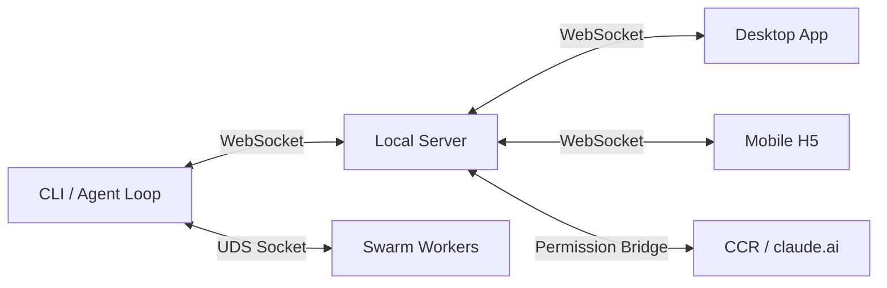
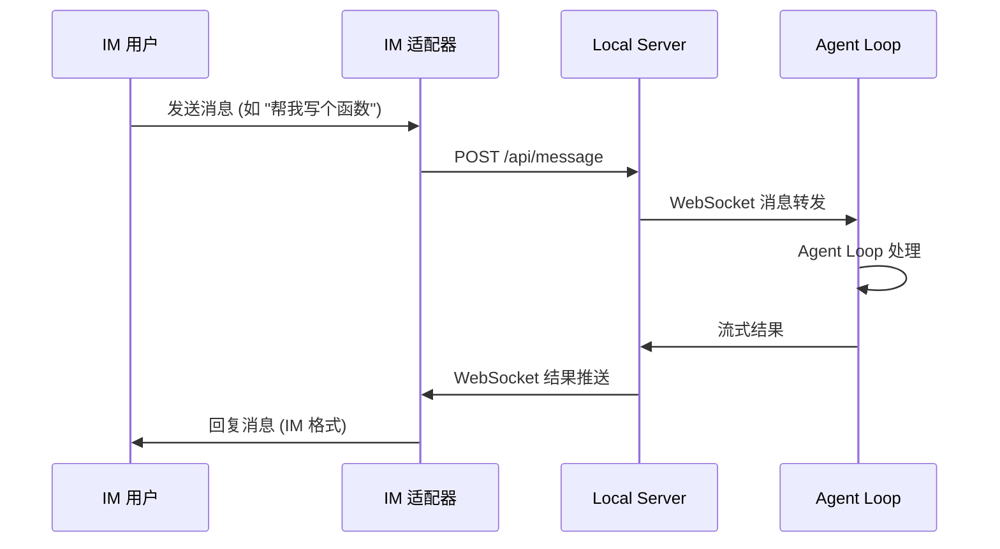

# Server、Desktop 与通信架构深度解析

> 本文详解 Claude Code 的本地 Server 架构、Desktop 桌面端设计，以及 CLI/Server/Desktop 之间的通信机制。

## 1. Server 架构

### 1.1 概述

Server 是一个基于 Bun HTTP 的本地服务器，同时提供 REST API 和 WebSocket 通信，用于连接 CLI 和 Desktop 应用。

```typescript
// src/server/index.ts（结构示意，真实签名见 index.ts:37-155）
const server = Bun.serve<WebSocketData>({
  port: Number.parseInt(portArg || process.env.SERVER_PORT || '3456', 10),
  idleTimeout: 60,
  async fetch(req, server) {
    const url = new URL(req.url)
    // CORS 预检 / Origin 校验（远程访问需 token 鉴权）

    // WebSocket 升级：路径是 /ws/ 前缀（index.ts:179）
    if (url.pathname.startsWith('/ws/')) {
      // 鉴权后 server.upgrade(req, { data: {...} })
    }

    // REST API 路由（router.ts）
    return router.handle(req)
  },
})
```

### 1.2 服务清单

`src/server/services/` 下有 30+ 个服务模块（`conversationService`、`sessionService`、`teamService`、`cronService`、`taskService`、`pluginService`、`providerService`、`settingsService`、`adapterService`、`agentService`、`diagnosticsService` 等；消息收发与权限请求走 WebSocket 事件而非独立 service）：

| 服务 | 文件 | 功能 |
|------|------|------|
| **会话回退** | `sessionRewindService.ts` | 预览/执行会话回退，恢复文件备份 |
| **搜索** | `searchService.ts` | 工作区文件搜索 + 会话历史搜索 |
| **工作树启动** | `repositoryLaunchService.ts` | Git worktree 会话启动器 |
| **工作区浏览器** | `workspaceService.ts` | 文件树、文件内容、diff 查看 |
| **诊断** | `doctorService.ts` | 持久化目标诊断（只读，不修复） |
| **Computer Use** | `computerUseApprovalService.ts` | MCP Computer Use 权限桥接 |
| **OpenAI OAuth** | `hahaOpenAIOAuthService.ts` | OpenAI/Codex OAuth 管理 |
| **H5 访问** | `h5AccessService.ts` | 移动端 Token 门控访问 |
| **团队监控** | `teamWatcher.ts` | 实时团队变更广播 |
| **MCP 预检** | `mcpHostPreflight.ts` | MCP 服务器命令验证 |
| **托管设置** | `managedSettingsService.ts` | 企业设置 CRUD |
| **存储迁移** | `persistentStorageMigrations.ts` | 存储格式升级 |
| **OAuth** | `hahaOAuthService.ts` | PKCE OAuth 流程 |
| **会话管理** | `sessionService.ts` | 会话列表、创建、恢复 |
| **对话服务** | `conversationService.ts` | 会话消息发送/查询（配合 WS handler） |
| **适配器** | `adapterService.ts` | IM 适配器（Telegram/飞书/钉钉/企微）管理 |

### 1.3 会话回退服务

```typescript
// src/server/services/sessionRewindService.ts (1152 行)

// 预览回退：计算需要移除的消息 + 代码差异
async function previewRewind(sessionId: string, turnIndex: number) {
  // 1. 找到目标轮次之后的所有消息
  const messagesToRemove = getMessagesAfterTurn(sessionId, turnIndex)

  // 2. 计算文件差异
  // 优先从 ~/.claude/file-history/{sessionId}/ 读取备份
  // 回退到从 tool_use 条目提取 diff（解析 write/edit/multiedit/notebookedit/apply_patch）
  const codeDiff = await computeCodeDiff(sessionId, turnIndex)

  return { messagesToRemove, codeDiff }
}

// 执行回退：停止会话，恢复文件，裁剪 JSONL
async function executeRewind(sessionId: string, turnIndex: number) {
  // 1. 停止活跃会话
  await stopActiveSession(sessionId)

  // 2. 从备份恢复文件
  await restoreFileBackups(sessionId, turnIndex)

  // 3. 裁剪 JSONL 会话文件
  await trimSessionJsonl(sessionId, turnIndex)
}
```

### 1.4 搜索服务

```typescript
// src/server/services/searchService.ts (453 行)

// 双重搜索：
// 1. 工作区文件搜索 (ripgrep > grep > 可移植文件系统降级)
// 2. 会话历史搜索 (遍历 ~/.claude/projects/ JSONL 文件)

async function search(query: string, options: SearchOptions) {
  const [fileResults, sessionResults] = await Promise.all([
    searchWorkspaceFiles(query, options),  // ripgrep 优先
    searchSessionHistory(query, options),   // JSONL 文件搜索
  ])

  return { files: fileResults, sessions: sessionResults }
}
```

### 1.5 工作区浏览器服务

```typescript
// src/server/services/workspaceService.ts (1670 行)

// getStatus(): Git 状态 + 会话文件变更合并
// readFile(): 文本/图片/二进制检测，1MB 预览限制
// readTree(): 目录列表（隐藏文件排除）
// getDiff(): 会话 diff > file-history diff > git diff（三级降级）

// 会话文件变更提取：解析 tool_use 条目
// (write, edit, multiedit, notebookedit, apply_patch)
```

### 1.6 Doctor 诊断服务

```typescript
// src/server/services/doctorService.ts (509 行)

// 检查所有持久化目标：
// - 用户设置、提供商配置、适配器配置
// - Skills、Teams、Plugins
// - MCP 配置、OAuth tokens
// - 会话 JSONL 文件

// 所有项目标记为 protected: true —— 修复是纯预览，永不修改
// 路径消毒：~ 替换主目录，<project> 替换项目根
```

### 1.7 H5 访问服务

```typescript
// src/server/services/h5AccessService.ts (411 行)

// Token 门控的移动端 Web 访问
// Token 存储为 SHA-256 哈希在托管设置中
// 自动发现 LAN IP (CLAUDE_H5_AUTO_PUBLIC_URL=1)
// Origin 白名单验证（无通配符，仅 http/https）
// 三级 URL 解析：环境变量 > 自动 LAN > 已存储
```

## 2. Desktop 架构

### 2.1 技术栈

```
Desktop App
├── Frontend: React 18 + Zustand (v5) + i18n (EN/ZH)   # desktop/package.json
├── Native:   Tauri (Rust)
├── Build:    Vite
├── Test:     Vitest + Testing Library (jsdom)
└── Communication: WebSocket → Server → CLI
```

（根 CLI 侧的 React 是 19.x；Desktop 前端锁在 18.3.x。）

### 2.2 目录结构

```
desktop/
├── src/
│   ├── api/              # API 客户端（与 Server 通信）
│   ├── components/       # 共享 UI 组件
│   ├── stores/           # Zustand 状态管理 (30+ 个 store 文件)
│   ├── hooks/            # React hooks
│   ├── i18n/             # 国际化 (locales, EN/ZH)
│   ├── pages/            # 页面组件
│   ├── types/            # TypeScript 类型
│   ├── utils/            # 工具函数
│   └── __tests__/        # 测试
├── src-tauri/
│   ├── src/              # Rust 代码
│   │   ├── sidecar.rs    # Sidecar 进程管理
│   │   ├── pty.rs        # PTY 集成
│   │   └── notifications.rs  # macOS ObjC 通知
│   ├── Cargo.toml
│   └── tauri.conf.json
└── scripts/
    └── build-macos-arm64.sh  # Apple Silicon 构建
```

### 2.3 状态管理 (Zustand Stores)

Desktop 使用 30+ 个 Zustand store 文件管理状态（`desktop/src/stores/`，含 `*.test.ts`）。真实清单（节选）：

| Store | 功能 |
|-------|------|
| `sessionStore` | 会话列表、当前会话、会话运行时（`sessionRuntimeStore`） |
| `chatStore` | 消息、流式更新、对话状态 |
| `adapterStore` | IM 适配器管理 |
| `agentStore` | Agent/团队状态展示 |
| `taskStore` / `cliTaskStore` | 后台任务与 CLI 任务 |
| `tabStore` | 多标签页 |
| `settingsStore` | 用户设置 |
| `mcpStore` | MCP 服务器状态 |
| `pluginStore` / `skillStore` | 插件与 Skill |
| `teamStore` | 团队和队友状态 |
| `workspacePanelStore` / `workspaceChatContextStore` | 工作区面板与上下文 |
| `providerStore` / `hahaOAuthStore` | Provider 与 OAuth |
| `uiStore` / `updateStore` / `terminalPanelStore` | UI、更新、终端面板 |

### 2.4 Tauri 集成

```rust
// desktop/src-tauri/src/sidecar.rs
// Sidecar 生命周期管理：
// 1. 启动 CLI 进程作为 sidecar
// 2. 管理标准 I/O
// 3. 监控进程健康
// 4. 处理崩溃重启

// desktop/src-tauri/src/pty.rs
// PTY (伪终端) 集成：
// 为 Bash 工具提供完整的终端模拟

// desktop/src-tauri/src/notifications.rs
// macOS 原生通知：
// 使用 Objective-C 桥接发送系统通知
```

### 2.5 Sidecar 构建与打包

```bash
# Sidecar 构建流程
bun run build:sidecars
# → 编译 Rust sidecar 二进制
# → 放置在 src-tauri/binaries/

# macOS ARM64 构建入口
desktop/scripts/build-macos-arm64.sh
# → 输出到 desktop/build-artifacts/macos-arm64/
```

## 3. 通信架构

### 3.1 三方通信模型



### 3.2 Bridge 通信

#### 环境型 Bridge (CCR v1)

```typescript
// 基于 CLAUDE_CODE_REMOTE=1 环境变量
// CLI 作为远程会话运行在 CCR 容器中
// 通过 HTTP 长轮询与 claude.ai 通信
```

#### 无环境型 Bridge (CCR v2)

```typescript
// 更新的协议，不依赖特定环境变量
// 支持 WebSocket 双向通信
// 权限请求/决策通过 bridge 传递
```

### 3.3 WebSocket 协议

真实事件类型定义在 `src/server/ws/events.ts:12-72`：

```typescript
// 客户端 → 服务器
type ClientMessage =
  | { type: 'prewarm_session' }
  | { type: 'user_message'; content: string; attachments?: AttachmentRef[] }
  | { type: 'permission_response'; ... }
  | { type: 'computer_use_permission_response'; ... }
  | { type: 'set_permission_mode'; mode: string }
  | { type: 'set_runtime_config'; providerId: string | null; modelId: string }
  | { type: 'stop_generation' }
  | { type: 'ping' }

// 服务器 → 客户端
type ServerMessage =
  | { type: 'connected'; sessionId: string }
  | { type: 'content_start'; blockType: 'text' | 'tool_use'; ... }
  | { type: 'content_delta'; text?: string; toolInput?: string }
  | { type: 'tool_use_complete'; toolName; toolUseId; input; ... }
  | { type: 'tool_result'; toolUseId; content; isError; ... }
  | { type: 'permission_request'; ... }
  | { type: 'computer_use_permission_request'; ... }
  | { type: 'message_complete'; usage: TokenUsage }
  | { type: 'thinking'; text: string }
  | { type: 'status'; state: ChatState; verb?; elapsed?; tokens? }
  | { type: 'error'; message; code; retryable? }
  | { type: 'system_notification'; subtype; message?; data? }
  | { type: 'team_update' | 'team_created' | 'team_deleted'; ... }
  | { type: 'task_update'; taskId; status; progress? }
  | { type: 'session_title_updated'; sessionId; title }
  | { type: 'pong' }
```

### 3.4 UDS (Unix Domain Socket) 通信

```typescript
// 用于同机器上的 Agent 间通信
// setup() 中启动 UDS 消息服务器

// Swarm Worker 通过 UDS 发送/接收消息：
// - SendMailboxMessage: 向队友邮箱发送消息
// - PollInbox: 轮询自己的邮箱
// - ListPeers: 列出已连接的 Agent
```

### 3.5 Channel 中继

```typescript
// 通过 MCP 通知将权限请求发送到 IM 渠道
// Telegram、iMessage 等
// 回复是纯 yes/no（无 updatedInput）
// 即发即弃，优雅降级
```

## 4. Adapters (IM 适配器)

### 4.1 架构

```
adapters/
├── telegram/     # Telegram Bot 适配器
├── feishu/       # 飞书 Bot 适配器
├── wechat/       # 企业微信适配器
├── dingtalk/     # 钉钉适配器
└── shared/       # 共享代码
```

### 4.2 Sidecar 隔离模型

```typescript
// 每个 IM 适配器作为独立 sidecar 进程运行
// 与主 CLI 进程隔离，避免互相影响

// 热重启：适配器崩溃后自动重启
// 通信：通过标准 I/O 或 WebSocket 与 Server 通信
```

### 4.3 适配器工作流



## 5. 团队监控系统

```typescript
// src/server/services/teamWatcher.ts (335 行)

// 每 3 秒轮询 ~/.claude/teams/ 目录
// 检测事件：
// - team_created: 新团队目录出现
// - team_update: config.json 修改
// - team_deleted: 团队目录消失

// 广播到所有已连接的 WebSocket 客户端
// 从以下位置发现成员：
// - config.json (团队配置)
// - inboxes/ 目录 (消息邮箱)
// - subagents/ 目录 (子代理)

// 部分JSON恢复：通过正则提取 agentId/name/isActive 字段
```

## 6. 如何构建自己的 Agent 服务端

### 6.1 最小 Server

```typescript
const server = Bun.serve({
  port: 3456,
  fetch(req) {
    // REST API
    return new Response(JSON.stringify({ status: 'ok' }))
  },
  websocket: {
    message(ws, msg) {
      // WebSocket 消息处理
      ws.send(JSON.stringify({ echo: msg }))
    }
  }
})
```

### 6.2 生产级增强

| 增强项 | 作用 | 复杂度 |
|--------|------|--------|
| WebSocket 双向通信 | 实时更新 | 中 |
| 权限桥接 | 远程权限决策 | 高 |
| 会话回退 | 撤销 Agent 操作 | 高 |
| 工作区浏览器 | 文件查看/编辑 | 中 |
| IM 适配器 | 多渠道接入 | 高 |
| Tauri 原生集成 | 桌面应用 | 高 |
| H5 访问 | 移动端 | 中 |
| 团队监控 | 多 Agent 管理 | 中 |
| Doctor 诊断 | 健康检查 | 低 |

## 7. 关键文件索引

| 文件 | 行数 | 功能 |
|------|------|------|
| `src/server/index.ts` | - | Bun HTTP + WS 服务器 |
| `src/server/services/sessionRewindService.ts` | 1152 | 会话回退 |
| `src/server/services/searchService.ts` | 453 | 双重搜索 |
| `src/server/services/repositoryLaunchService.ts` | 643 | Worktree 启动 |
| `src/server/services/workspaceService.ts` | 1670 | 工作区浏览器 |
| `src/server/services/doctorService.ts` | 509 | 诊断 |
| `src/server/services/computerUseApprovalService.ts` | 73 | Computer Use 权限 |
| `src/server/services/hahaOpenAIOAuthService.ts` | 208 | OpenAI OAuth |
| `src/server/services/h5AccessService.ts` | 411 | H5 访问 |
| `src/server/services/teamWatcher.ts` | 335 | 团队监控 |
| `src/server/services/mcpHostPreflight.ts` | 166 | MCP 预检 |
| `src/server/services/managedSettingsService.ts` | 83 | 托管设置 |
| `src/server/services/persistentStorageMigrations.ts` | 194 | 存储迁移 |
| `desktop/src/` | - | React UI 代码 |
| `desktop/src-tauri/` | - | Tauri 原生集成 |
| `adapters/` | - | IM 适配器 |
