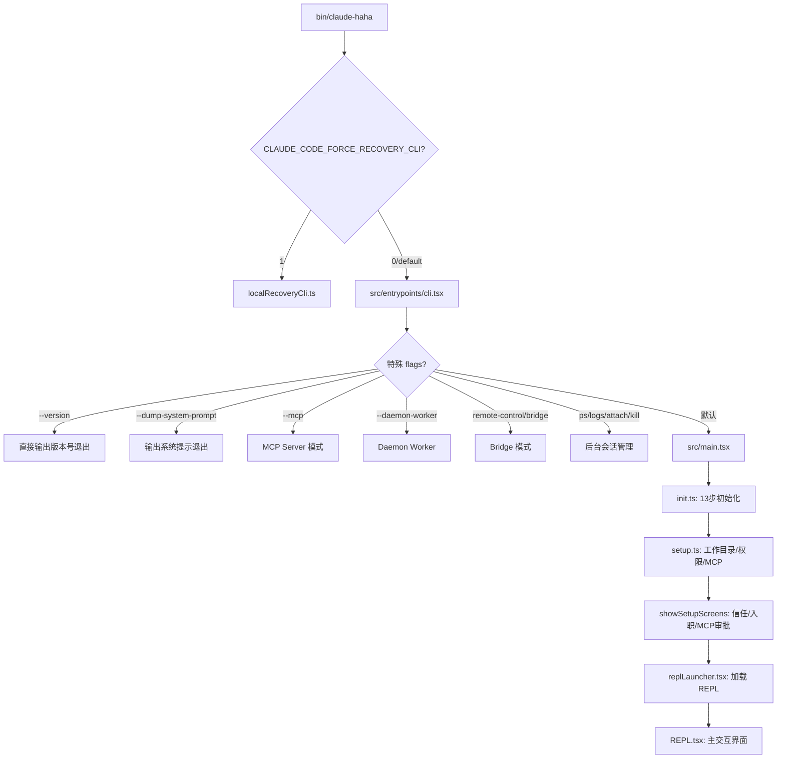
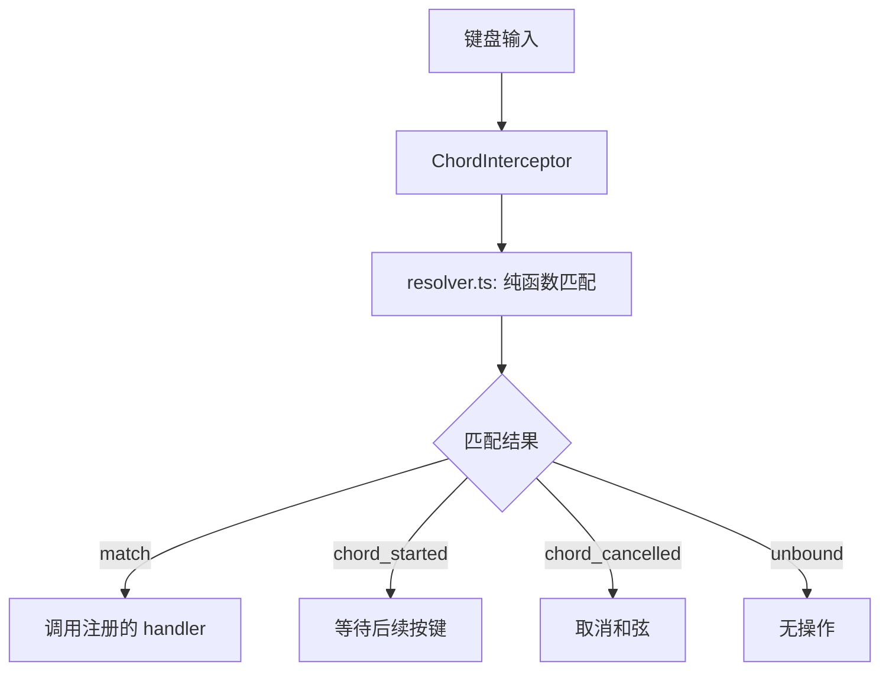

# CLI 启动流程与 TUI 系统深度解析

> 本文详解从用户执行 `claude` 命令到 REPL 界面完全就绪的全过程，以及 Ink TUI 引擎和按键系统的内部机制。

## 1. 完整启动流程

### 1.1 流程概览



### 1.2 入口脚本

```bash
# bin/claude-haha
#!/usr/bin/env bash
set -euo pipefail
ROOT_DIR="$(cd "$(dirname "${BASH_SOURCE[0]}")/.." && pwd)"
cd "$ROOT_DIR"

if [[ "${CLAUDE_CODE_FORCE_RECOVERY_CLI:-0}" == "1" ]]; then
  exec bun --env-file=.env ./src/localRecoveryCli.ts "$@"
fi

exec bun --env-file=.env ./src/entrypoints/cli.tsx "$@"
```

### 1.3 CLI 引导器 (cli.tsx)

```typescript
// src/entrypoints/cli.tsx (303 行)
// 设计哲学：最小化模块加载，快速路径零依赖

async function main(): Promise<void> {
  // 1. 设置环境
  process.env.COREPACK_ENABLE_AUTO_PIN = '0'
  // CCR 环境: --max-old-space-size=8192

  // 2. 消融基线设置 (L0 harness 实验)
  // 设置 SIMPLE 模式、禁用思考/压缩/自动记忆/后台任务

  // 3. 快速路径 (零模块加载)
  const args = process.argv.slice(2)
  if (args.length === 1 && (args[0] === '--version' || args[0] === '-v')) {
    console.log(`${MACRO.VERSION} (Claude Code)`)
    return  // 最快退出
  }

  // 4. 特殊用途快速路径 (动态导入)
  if (args.includes('--dump-system-prompt')) { ... }
  if (args.includes('--claude-in-chrome-mcp')) { ... }
  if (args.includes('--daemon-worker')) { ... }

  // 5. 子命令路由
  if (args[0] === 'remote-control' || ...) { return bridgeMain() }
  if (args[0] === 'daemon') { return daemonMain() }
  if (['ps','logs','attach','kill'].includes(args[0])) { return bgMain() }

  // 6. 默认：加载完整 CLI (最重的路径)
  const { main: cliMain } = await import('../main.js')
  await cliMain()
}
```

### 1.4 完整初始化 (init.ts)

```typescript
// src/entrypoints/init.ts (340 行)
// init() 是幂等的（memoized，只执行一次）

export async function init(): Promise<void> {
  // Step 1:  启用配置系统
  enableConfigs()

  // Step 2:  应用安全环境变量 (信任对话框之前)
  applySafeConfigEnvironmentVariables()

  // Step 3:  设置 CA 证书 (在任何 TLS 之前)
  applyExtraCACertsFromConfig()

  // Step 4:  优雅关闭处理
  setupGracefulShutdown()

  // Step 5:  懒初始化 1P 事件日志 + GrowthBook (异步非阻塞)
  initialize1PEventLogging()
  growthbookRefreshHook()

  // Step 6:  填充 OAuth 账户信息 (VSCode 扩展登录)
  populateOAuthAccountInfoIfNeeded()

  // Step 7:  JetBrains IDE 检测 (异步缓存)
  initJetBrainsDetection()

  // Step 8:  Git 仓库检测 (异步缓存)
  detectCurrentRepository()

  // Step 9:  远程托管设置 + 策略限制 (企业用户)
  initializeRemoteManagedSettingsLoadingPromise()
  initializePolicyLimitsLoadingPromise()

  // Step 10: 记录首次启动时间
  recordFirstStartTime()

  // Step 11: mTLS + 代理配置
  configureGlobalMTLS()
  configureGlobalAgents()

  // Step 12: API 预连接 (暖 TCP+TLS，~100-200ms)
  preconnectAnthropicApi()

  // Step 13: CCR 上游代理、Shell 设置、LSP 清理、团队清理、Scratchpad
}
```

### 1.5 遥测初始化 (信任后)

```typescript
// initializeTelemetryAfterTrust()
// 在用户接受信任对话框后调用

// 1. 等待远程设置加载（如适用）
// 2. 重新应用环境变量
// 3. 初始化 OTel 遥测（懒加载 ~400KB OTel + protobuf）
// 4. 创建 AttributedCounter 工厂：
//    - session 计数器
//    - LOC 计数器
//    - PR 计数器
//    - commit 计数器
//    - cost 计数器
//    - token 计数器
//    - code-edit-tool-decision 计数器
//    - active-time 计数器
```

### 1.6 主程序 (main.tsx)

```typescript
// src/main.tsx (4748 行)
// 庞大的 Commander.js 程序定义

// 顶层副作用（在导入前执行）：
profileCheckpoint('main_tsx_entry')
startMdmRawRead()       // macOS MDM 读取（与模块加载并行，~135ms）
startKeychainPrefetch()  // macOS Keychain 预取

// 定义 Commander 程序
const program = new Command()
program
  .name('claude')
  .option('-p, --print', '无头模式')
  .option('--model <model>', '指定模型')
  .option('--resume', '恢复上次会话')
  .option('--allowedTools <tools>', '允许的工具列表')
  .option('--disallowedTools <tools>', '禁止的工具列表')
  .option('--dangerously-skip-permissions', '跳过权限检查')
  .option('--permission-mode <mode>', '权限模式')
  .option('--worktree', '工作树模式')
  .option('--remote', '远程模式')
  .option('--bg', '后台运行')
  .option('--add-dir <dir>', '额外工作目录')
  .option('--plugin-dir <dir>', '插件目录')
  // ... 更多选项

// 主 action 处理器 (~line 2000+):
async function actionHandler(options) {
  await init()
  await setup(cwd, permissionMode, ...)

  // 构造 replProps
  const replProps = {
    tools: await getTools(permissionContext),
    commands: await getCommands(cwd),
    mcpClients: await initializeMcpClients(),
    agentDefinitions: await getAgentDefinitions(),
    permissionMode,
    systemPrompt: await buildSystemPrompt(),
    thinkingConfig: getThinkingConfig(),
    // ...
  }

  // 启动 REPL 或 恢复选择器
  if (options.resume) {
    launchResumeChooser(replProps)
  } else {
    launchRepl(replProps)
  }
}
```

### 1.7 Setup 初始化 (setup.ts)

```typescript
// src/setup.ts (493 行)
export async function setup(cwd, permissionMode, ...): Promise<void> {
  // 1. Node.js 版本检查 (>= 18)
  // 2. 自定义会话 ID
  // 3. 启动 UDS 消息服务器 (Swarm 通信)
  // 4. 捕获 hooks 配置快照
  // 5. 启动文件变更监听器 (hook 触发器)
  // 6. 找到 git root，设置项目根目录
  // 7. 工作树设置 (如果启用)
  // 8. 后台家务任务
  // 9. 初始化会话记忆
  //10. 恢复终端备份 (Apple Terminal, iTerm2)
  //11. 锁定当前版本 (原生安装器)
}
```

### 1.8 交互式前置对话框 (showSetupScreens)

```typescript
// src/interactiveHelpers.tsx (366 行)

async function showSetupScreens(root): Promise<SessionConfig> {
  // 1. 信任对话框 (是否信任此项目的 .claude/ 配置?)
  // 2. 入职引导 (首次使用)
  // 3. GrowthBook 初始化
  // 4. Claude.md 外部包含警告
  // 5. MCP 服务器审批
  // 6. 无效设置对话框
  // → 返回会话配置
}
```

### 1.9 REPL 启动

```typescript
// src/replLauncher.tsx (23 行)
async function launchRepl(appProps, replProps) {
  // 动态导入 (延迟重模块加载)
  const { App } = await import('../components/App.js')
  const { REPL } = await import('../screens/REPL.js')

  renderAndRun(
    root,
    <App {...appProps}>
      <REPL {...replProps} />
    </App>
  )
}
```

## 2. Ink TUI 引擎

### 2.1 架构

Ink 是 React 的终端渲染版本。Claude Code 使用定制版 Ink，增加了主题系统、和弦键序列、终端查询等。

```
src/ink.ts          → 薄封装层，重新导出所有组件
src/ink/            → Ink 内部实现 (50 文件)
  ├── reconciler/   → React 协调器适配
  ├── renderer/     → 终端渲染器
  ├── layout/       → Yoga 布局引擎
  ├── events/       → 键盘/点击/粘贴/调整大小/焦点
  ├── hit-test/     → 点击目标检测
  ├── cursor/       → 光标管理
  ├── termio/       → OSC/DEC 序列
  └── dom/          → 终端 DOM 模型
```

### 2.2 主题系统

```typescript
// src/ink.ts
// 所有 render() 和 createRoot() 调用自动包裹 ThemeProvider
// ThemedBox / ThemedText 读取当前主题

export const Box = ThemedBox       // 主题化容器
export const Text = ThemedText     // 主题化文本
export { ThemeProvider, useTheme, usePreviewTheme, useThemeSetting }
```

### 2.3 核心组件导出

```typescript
// 基础组件
BaseBox, BaseText, Button, Link, Newline, Spacer, Ansi, RawAnsi, NoSelect

// Hooks
useApp, useInput, useStdin, useAnimationFrame, useInterval
useSelection, useTabStatus, useTerminalFocus, useTerminalTitle, useTerminalViewport

// 内部
FocusManager, measureElement, wrapText, ClickEvent, InputEvent
```

## 3. 按键绑定系统

### 3.1 架构



### 3.2 18 个上下文

```typescript
// src/keybindings/schema.ts (236 行)
const CONTEXTS = [
  'Global', 'Chat', 'Autocomplete', 'Confirmation', 'Help',
  'Transcript', 'HistorySearch', 'Task', 'ThemePicker', 'Settings',
  'Tabs', 'Attachments', 'Footer', 'MessageSelector', 'DiffDialog',
  'ModelPicker', 'Select', 'Plugin',
]
```

### 3.3 80+ 个动作

```typescript
const ACTIONS = [
  // 应用级别
  'app:interrupt', 'app:exit', 'app:toggleTodos', 'app:toggleTranscript',
  'app:toggleBrief', 'app:toggleTeammatePreview', 'app:toggleTerminal',
  'app:redraw', 'app:globalSearch', 'app:quickOpen',

  // 聊天级别
  'chat:cancel', 'chat:killAgents', 'chat:cycleMode', 'chat:modelPicker',
  'chat:fastMode', 'chat:thinkingToggle', 'chat:submit', 'chat:historyUp',
  'chat:historyDown', 'chat:undo', 'chat:externalEditor', 'chat:stash',
  'chat:imagePaste',

  // 命令绑定 (如 command:help, command:compact)
  // null 解绑 (移除绑定)
]
```

### 3.4 默认绑定

```typescript
// src/keybindings/defaultBindings.ts (340 行)

// 平台感知：
// IMAGE_PASTE_KEY: alt+v (Windows) / ctrl+v (其他)
// MODE_CYCLE_KEY: meta+m (Windows w/o VT) / shift+tab (其他)

// VT 模式检测：
// Bun >= 1.2.23 或 Node >= 22.17.0/24.2.0

const DEFAULT_BINDINGS = [
  // Global
  { context: 'Global', key: 'ctrl+c', action: 'app:interrupt' },
  { context: 'Global', key: 'ctrl+d', action: 'app:exit' },
  { context: 'Global', key: 'ctrl+l', action: 'app:redraw' },
  { context: 'Global', key: 'ctrl+t', action: 'app:toggleTodos' },
  { context: 'Global', key: 'ctrl+o', action: 'app:toggleTranscript' },
  { context: 'Global', key: 'ctrl+shift+o', action: 'app:toggleTeammatePreview' },
  { context: 'Global', key: 'ctrl+r', action: 'history:search' },

  // Chat
  { context: 'Chat', key: 'escape', action: 'chat:cancel' },
  { context: 'Chat', key: 'ctrl+x ctrl+k', action: 'chat:killAgents' },
  { context: 'Chat', key: 'shift+tab', action: 'chat:cycleMode' },
  { context: 'Chat', key: 'meta+p', action: 'chat:modelPicker' },
  { context: 'Chat', key: 'meta+o', action: 'chat:fastMode' },
  { context: 'Chat', key: 'meta+t', action: 'chat:thinkingToggle' },
  { context: 'Chat', key: 'enter', action: 'chat:submit' },
  { context: 'Chat', key: 'up', action: 'chat:historyUp' },
  { context: 'Chat', key: 'down', action: 'chat:historyDown' },
  // ... 更多上下文
]
```

### 3.5 和弦 (Chord) 处理

```typescript
// src/keybindings/resolver.ts (244 行)

// 纯函数解析：
function resolveKey(input, key, activeContexts, bindings): ResolveResult {
  // 返回: 'match' | 'none' | 'unbound'
}

// 和弦状态处理：
function resolveKeyWithChordState(input, key, state, bindings) {
  // ctrl+x ctrl+k:
  //   1. 按 ctrl+x → chord_started (等待后续)
  //   2. 按 ctrl+k → match (触发 chat:killAgents)
  //   3. 按 其他 → chord_cancelled

  // 和弦前缀匹配：检查当前输入是否可能是更长和弦的前缀
  // 如果是，进入和弦等待状态而不是触发单键匹配

  // 最后绑定优先：迭代所有绑定，最后一个匹配优先
  // (允许用户覆盖覆盖默认值)

  // Alt/Meta 折叠：alt+k 和 meta+k 视为相同键
  // (传统终端限制)；super (Cmd/Win) 是独立的
  // (仅通过 kitty 键盘协议)
}
```

### 3.6 和弦拦截器

```typescript
// src/keybindings/KeybindingProviderSetup.tsx (308 行)

// ChordInterceptor: 在所有子组件之前注册 useInput
// 当和弦匹配且 wasInChord=true 时：
//   → 在 handler 注册表中查找动作
//   → 直接调用注册的 handler
// 和弦超时: 1000ms (未完成则取消)
```

### 3.7 useKeybinding Hook

```typescript
// src/keybindings/useKeybinding.ts (196 行)

function useKeybinding(action, handler, { context, isActive }) {
  // 1. 构建上下文列表：[...activeContexts, context, 'Global']
  // 2. useInput 拦截按键
  // 3. match → 调用 handler，stopImmediatePropagation
  // 4. chord_started → 更新 pending chord，stop propagation
  // 5. chord_cancelled/unbound → 清除 pending chord
}

// 批量版本
function useKeybindings(handlers, options) { ... }
```

## 4. 命令系统

### 4.1 命令注册

```typescript
// src/commands.ts (752 行)
// 90+ 斜杠命令

const COMMANDS = memoize(() => {
  const commands: Command[] = []

  // 静态导入 (~70 个命令)
  commands.push(
    helpCommand, compactCommand, clearCommand, costCommand,
    modelCommand, themeCommand, vimCommand, statusCommand,
    // ... 更多
  )

  // 特性门控导入 (条件 require)
  if (feature('proactive')) commands.push(proactiveCommand)
  if (feature('voice')) commands.push(voiceCommand)
  if (feature('workflows')) commands.push(workflowsCommand)
  // ...

  return commands
})

// 仅内部命令
const INTERNAL_ONLY_COMMANDS = [
  'backfillSessions', 'breakCache', 'bughunter', 'commit',
  'commitPushPr', 'ctx_viz', 'goodClaude', 'issue', ...
]
```

### 4.2 命令类型

```typescript
type Command = {
  type: 'local' | 'local-jsx' | 'prompt'
  name: string               // 如 'help', 'compact'
  description: string
  aliases: string[]           // 如 ['h'] for help
  handler?: (args) => void    // local 类型
  getPromptForCommand?: (args) => string  // prompt 类型
  isEnabled?: () => boolean
  availability?: 'claude-ai' | 'console'
  source?: string             // 'builtin' | 'skill' | 'plugin'
  loadedFrom?: string
  kind?: string
}
```

### 4.3 安全命令白名单

```typescript
// 远程模式安全的命令
const REMOTE_SAFE_COMMANDS = [
  'session', 'exit', 'clear', 'help', 'theme', 'color', 'vim',
  'cost', 'usage', 'copy', 'btw', 'feedback', 'plan',
  'keybindings', 'statusline', 'stickers', 'mobile',
]

// Bridge 模式安全的命令
const BRIDGE_SAFE_COMMANDS = [
  'compact', 'clear', 'cost', 'summary', 'releaseNotes', 'files',
]

// isBridgeSafeCommand():
// 'prompt' 类型 → 总是安全
// 'local' 类型 → 需要显式白名单
// 'local-jsx' 类型 → 总是不安全
```

## 5. Bootstrap 状态

### 5.1 中央可变单例

```typescript
// src/bootstrap/state.ts (1781 行)
// ~260 个字段的中央状态对象

const State = {
  // 路径
  originalCwd, projectRoot, cwd, sessionProjectDir,
  additionalDirectoriesForClaudeMd,

  // 成本/时间
  totalCostUSD, totalAPIDuration, totalAPIDurationWithoutRetries,
  totalToolDuration, turnHookDurationMs, turnToolDurationMs,
  turnClassifierDurationMs, totalLinesAdded, totalLinesRemoved,

  // 模型
  mainLoopModelOverride, initialMainLoopModel, modelStrings, modelUsage,

  // 会话
  sessionId, parentSessionId, isInteractive, kairosActive,
  clientType, sessionSource, sessionBypassPermissionsMode,
  sessionTrustAccepted, sessionPersistenceDisabled,

  // 遥测
  meter, meterProvider, tracerProvider, loggerProvider, eventLogger,

  // API
  lastAPIRequest, lastAPIRequestMessages, lastClassifierRequests,
  lastMainRequestId, lastApiCompletionTimestamp,

  // Agent/Swarm
  agentColorMap, agentColorIndex, mainThreadAgentType,

  // 缓存
  promptCache1hAllowlist, promptCache1hEligible,
  afkModeHeaderLatched, fastModeHeaderLatched,

  // Hooks
  registeredHooks, cachedClaudeMdContent,

  // ... 还有 ~200 个字段
}

// 每个字段都有 get*() 和 set*() 方法
// 状态是可变对象（非不可变）—— Agent Loop 直接写入
```

## 6. 如何构建自己的 Agent CLI

### 6.1 最小实现

```typescript
#!/usr/bin/env node
import { Command } from 'commander'

const program = new Command()
program
  .option('--model <model>')
  .action(async (opts) => {
    const messages = []
    const tools = loadTools()
    while (true) {
      const input = await readUserInput()
      messages.push({ role: 'user', content: input })
      const response = await callLLM(messages, tools, opts.model)
      messages.push(response)
      if (noToolCalls(response)) break
      const results = await executeTools(response, tools)
      messages.push({ role: 'user', content: results })
    }
  })

program.parse()
```

### 6.2 生产级增强路径

| 增强项 | 作用 | 复杂度 |
|--------|------|--------|
| 快速路径路由 | 零模块加载启动 | 低 |
| 13 步初始化 | 安全/网络/遥测 | 高 |
| 信任对话框 | 项目安全 | 中 |
| Ink TUI | 终端 UI | 高 |
| 和弦按键 | 专业级交互 | 中 |
| 主题系统 | 用户体验 | 低 |
| 命令系统 | 扩展性 | 中 |
| MCP 审批 | 安全 | 低 |
| 状态单例 | 共享状态 | 低 |
| 模型迁移 | 平滑升级 | 低 |

## 7. 关键文件索引

| 文件 | 行数 | 功能 |
|------|------|------|
| `bin/claude-haha` | - | Shell 入口脚本 |
| `src/entrypoints/cli.tsx` | 303 | CLI 引导器（快速路径路由） |
| `src/entrypoints/init.ts` | 340 | 13 步完整初始化 |
| `src/main.tsx` | 4748 | 主程序（Commander + 选项解析） |
| `src/setup.ts` | 493 | 工作目录/权限/MCP 初始化 |
| `src/interactiveHelpers.tsx` | 366 | 前置对话框流程 |
| `src/replLauncher.tsx` | 23 | REPL 启动器 |
| `src/screens/REPL.tsx` | 5003 | 主交互界面 |
| `src/commands.ts` | 752 | 90+ 斜杠命令注册 |
| `src/keybindings/schema.ts` | 236 | 按键绑定 schema |
| `src/keybindings/defaultBindings.ts` | 340 | 默认按键绑定 |
| `src/keybindings/resolver.ts` | 244 | 按键解析纯函数 |
| `src/keybindings/useKeybinding.ts` | 196 | React hook |
| `src/keybindings/KeybindingProviderSetup.tsx` | 308 | 主题提供器 + 和弦拦截 |
| `src/ink.ts` | 85 | Ink 封装层 |
| `src/ink/` | 50 files | Ink 内部实现 |
| `src/bootstrap/state.ts` | 1781 | 中央可变状态单例 |
| `src/cost-tracker.ts` | 381 | 成本追踪 |
| `src/constants/system.ts` | - | 系统提示和归因头 |
| `src/entrypoints/mcp.ts` | 196 | MCP Server 入口 |
| `src/entrypoints/agentSdkTypes.ts` | 443 | Agent SDK API |
| `src/migrations/` | 11 files | 模型/设置迁移 |
