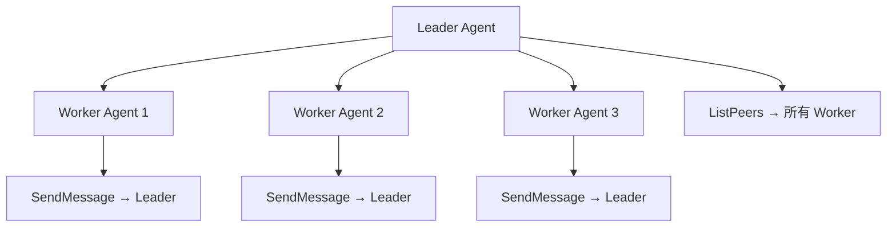
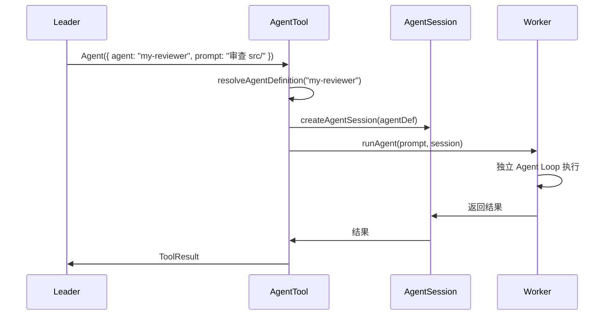
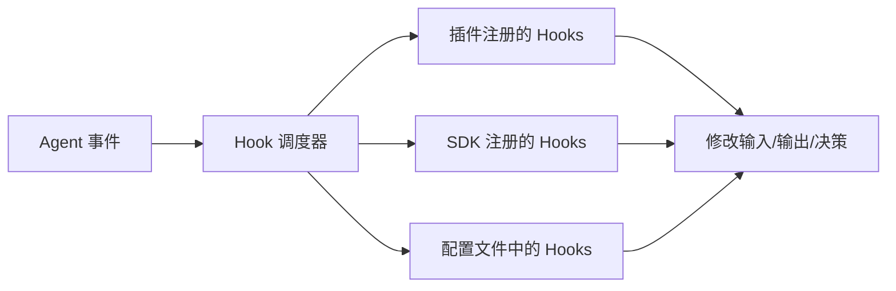
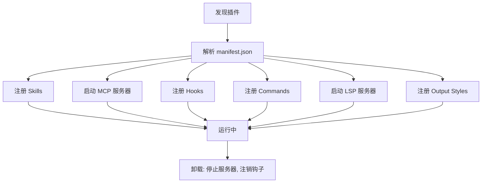

# 多 Agent 协作与 Hooks 系统深度解析

> 本文详解 Claude Code 的多 Agent 协作架构（Swarm 模式）、Agent 间通信机制，以及贯穿全系统的 Hooks 事件机制。

## 1. 多 Agent 架构

### 1.1 概述

Claude Code 支持多 Agent 协作——一个"Leader"Agent 可以启动多个"Worker"Agent，形成 Swarm（集群）模式。



### 1.2 Agent 定义

```typescript
type AgentDefinition = {
  name: string                  // Agent 名称
  description: string           // 描述
  instructions: string          // Agent 级系统提示
  tools: string[]               // 允许的工具列表
  model?: string                // 使用的模型
  color?: string                // 终端颜色标识
  isMainAgent?: boolean         // 是否是主 Agent
}

// Agent 定义来源：
// 1. 内置 Agent (bundledAgents.ts): 6 个类型
// 2. 项目 Agent (.claude/agents/*.md)
// 3. 用户 Agent (~/.claude/agents/*.md)
// 4. 插件 Agent
```

### 1.3 内置 Agent 类型

内置 Agent 主要用 **disallowedTools**（黑名单）而非白名单定义（`src/tools/AgentTool/built-in/*.ts`）：

| Agent | 功能 | 工具限制（源码） |
|-------|------|------------|
| `generalPurpose` | 通用助手 | 默认全量（受 ALL_AGENT_DISALLOWED_TOOLS 约束） |
| `claudeCodeGuide` | Claude Code 使用指南 | `disallowedTools` 收窄为只读/检索类 |
| `explore` | 代码探索 | 禁 Agent/ExitPlanMode/写工具（Edit/Write/NotebookEdit），保留 Bash 等只读能力 |
| `plan` | 制定计划 | 同 explore（禁所有写工具），强调"只探索和规划" |
| `verification` | 验证结果 | 禁写工具，保留运行测试/lint 的 Bash 能力 |
| `statuslineSetup` | 终端状态栏设置 | 允许 Bash/Read/Write（需要写 shell 配置） |

### 1.4 自定义 Agent

```markdown
<!-- .claude/agents/my-reviewer.md -->
---
name: my-reviewer
description: 代码审查专家
model: opus
tools:
  - Read
  - Grep
  - Glob
  - Bash
---

你是一个专业的代码审查专家。请检查：
1. 安全漏洞
2. 性能问题
3. 代码风格
```

## 2. Agent 生命周期

### 2.1 创建流程



### 2.2 Agent Fork

```typescript
// src/tools/AgentTool/forkSubagent.ts

// Fork：从当前 Agent 状态创建子 Agent
// 子 Agent 继承：
// - 当前对话历史
// - 工具配置
// - 权限上下文
// - 父 Agent 的记忆快照

// 但不继承：
// - 活跃的工具执行
// - UI 状态
// - 权限决策缓存
```

### 2.3 Agent 恢复

```typescript
// src/tools/AgentTool/resumeAgent.ts

// 恢复暂停的 Agent
// 1. 读取保存的 Agent 状态
// 2. 重建对话上下文
// 3. 恢复记忆快照
// 4. 继续执行
```

### 2.4 Agent 记忆

```typescript
// src/tools/AgentTool/agentMemory.ts

// Agent 可以保存和读取记忆
// 记忆存储在: ~/.claude/agent-memory/{agentId}/

// 记忆快照 (agentMemorySnapshot.ts):
// - 保存 Agent 的关键状态
// - 允许 Agent 跨会话持久化
// - 支持合并/替换/保留策略
```

### 2.5 Agent 颜色管理

```typescript
// src/tools/AgentTool/agentColorManager.ts

// 每个 Agent 分配唯一颜色用于终端显示
// 颜色从预定义调色板中循环分配
// 支持最多 16 种不同颜色
```

## 3. Swarm 通信

### 3.1 UDS 消息传递

```typescript
// Unix Domain Socket 用于同机器上的 Agent 间通信
// setup() 中启动 UDS 消息服务器

// 消息类型：
// - SendMailboxMessage: 向队友邮箱发送消息
// - PollInbox: 轮询自己的邮箱
// - ListPeers: 列出已连接的 Agent
```

### 3.2 SendMessageTool

```typescript
// src/tools/SendMessageTool/

// Agent 间消息传递
const SendMessageTool = {
  name: 'SendMessage',
  input_schema: {
    type: 'object',
    properties: {
      recipient: { type: 'string', description: 'Target agent ID' },
      message: { type: 'string', description: 'Message content' },
    },
    required: ['recipient', 'message'],
  },
  async call(input, context) {
    // 1. 查找目标 Agent
    // 2. 将消息写入目标邮箱
    // 3. 目标 Agent 的 inbox 轮询接收
  },
}
```

### 3.3 ListPeersTool

```typescript
// src/tools/ListPeersTool/

// 列出所有已连接的 Agent
const ListPeersTool = {
  name: 'ListPeers',
  async call(input, context) {
    // 返回：[{ agentId, name, status, color }]
  },
}
```

### 3.4 Swarm Worker 权限

```typescript
// Worker Agent 的权限通过 Leader 代理
// 1. Worker 检查本地权限
// 2. 如果需要用户确认，发送邮箱消息给 Leader
// 3. Leader 代为请求用户确认
// 4. 结果回传给 Worker
```

## 4. In-Process Teammate 模式

### 4.1 概述

除了独立进程的 Worker Agent 外，还有"进程内队友"模式：

```typescript
// 允许的工具
const IN_PROCESS_TEAMMATE_ALLOWED_TOOLS = [
  'TaskCreate', 'TaskGet', 'TaskList', 'TaskUpdate',
  'SendMessage', 'CronCreate', 'CronDelete', 'CronList',
]
```

### 4.2 Coordinator 模式

```typescript
// 协调器模式的允许工具
const COORDINATOR_MODE_ALLOWED_TOOLS = [
  // 任务管理
  'TaskCreate', 'TaskGet', 'TaskList', 'TaskOutput', 'TaskUpdate', 'TaskStop',
  // 团队管理
  'TeamCreate', 'TeamDelete', 'SendMessage', 'ListPeers',
  // Agent
  'Agent',
]
```

## 5. Hooks 系统

### 5.1 架构概述

Hooks 是贯穿整个 Agent 生命周期的事件系统，允许外部代码在关键节点介入。



### 5.2 27 个 Hook 事件

```typescript
// src/entrypoints/sdk/coreTypes.ts
const HOOK_EVENTS = [
  // 工具钩子 (3)
  'PreToolUse',              // 工具调用前
  'PostToolUse',             // 工具调用后（成功）
  'PostToolUseFailure',      // 工具调用后（失败）

  // 通知与输入
  'Notification',            // 通知
  'UserPromptSubmit',        // 用户提交提示

  // 会话钩子
  'SessionStart',            // 会话开始
  'SessionEnd',              // 会话结束
  'Stop',                    // Agent 停止
  'StopFailure',             // Agent 停止（失败）

  // Agent 钩子
  'SubagentStart',           // 子 Agent 启动
  'SubagentStop',            // 子 Agent 停止

  // 压缩钩子
  'PreCompact',              // 消息压缩前
  'PostCompact',             // 消息压缩后

  // 权限钩子
  'PermissionRequest',       // 权限请求
  'PermissionDenied',        // 权限拒绝

  // 初始化与任务
  'Setup',                   // 设置钩子（init 触发）
  'TeammateIdle',            // 队友空闲
  'TaskCreated',             // 任务创建
  'TaskCompleted',           // 任务完成

  // 引导钩子
  'Elicitation',             // MCP Elicitation 请求
  'ElicitationResult',       // MCP Elicitation 结果

  // 配置钩子
  'ConfigChange',            // 配置变更

  // 工作树钩子
  'WorktreeCreate',          // 工作树创建
  'WorktreeRemove',          // 工作树移除

  // 环境钩子
  'InstructionsLoaded',      // 指令加载完成
  'CwdChanged',              // 工作目录变更
  'FileChanged',             // 文件变更
]  // 共 27 个（与 coreTypes.ts:25-53 一致）
```

### 5.3 Hook 注册

真实配置结构支持四种 hook 类型（`src/utils/hooks/hooksSettings.ts:31-37`：command/prompt/agent/http），每条 hook 带 `matcher`（如 `Bash(git *)`）、`if` 条件与 timeout：

```typescript
export type HookSource =
  | EditableSettingSource        // user/project/local settings
  | 'policySettings'             // 企业策略
  | 'pluginHook'                 // 插件
  | 'sessionHook'                // 会话注册（SDK）
  | 'builtinHook'                // 内置（frontmatter hooks 等）

export interface IndividualHookConfig {
  event: HookEvent               // 27 个事件之一
  config: HookCommand           // { type: 'command'|'prompt'|'agent'|'http', ... }
  matcher?: string               // 工具匹配（如 "Bash(git *)"）
  source: HookSource
  pluginName?: string
}
```

配置文件注册（`~/.claude/settings.json` / 项目 `.claude/settings.json`）：

```json
{
  "hooks": {
    "PreToolUse": [
      {
        "matcher": "Bash(git *)",
        "hooks": [
          { "type": "command", "command": "echo 'About to use tool'" }
        ]
      }
    ]
  }
}
```

（HookCommand 形状以 `src/utils/settings/types.ts` 为准；Skill frontmatter 也可声明 hooks。）

### 5.4 Hook 执行流程

真实执行按 hook 类型分派（`src/utils/hooks/execAgentHook.ts`、`execHttpHook.ts`、`execPromptHook.ts`），hook 进程/请求通过 stdin JSON 事件 + 环境变量（`TOOL_NAME` 等）接收上下文；`AsyncHookRegistry` 负责并发与超时：

```typescript
// 结构示意：
// 1. 按 event + matcher 过滤出命中的 hooks
// 2. 逐个执行（command → shell；http → fetch；agent/prompt → LLM sideQuery）
// 3. 解析退出码 / stdout JSON 决策（deny/block 等语义随事件不同）
// 4. 失败降级：PreToolUse hooks 崩溃 → auto-deny 而不是 crash（permissions.ts:465）
```

### 5.5 权限系统中的 Hooks

```typescript
// PermissionRequest hooks 可以在用户响应前覆盖权限决策
// 这是 4 路竞争架构中的"后台异步检查"路径

// 示例：自动批准特定 Bash 命令
registerHook('PermissionRequest', async (context) => {
  if (context.toolName === 'Bash' && context.input.command.startsWith('git ')) {
    return { decision: 'allow', reason: 'Git commands are safe' }
  }
})
```

### 5.6 Bash 分类器 Hook

```typescript
// BASH_CLASSIFIER 特性启用时
// 后台运行 Bash 命令安全分类
// 在用户看到权限对话框前完成判断

// allow: 显示 ✓ 1-3 秒后自动移除对话框
// dismiss: 用户按 Esc 取消计时器
// 记录分类器批准类型（auto-mode vs prompt rule）
```

## 6. 插件系统

### 6.1 插件结构

```
~/.claude/plugins/my-plugin/
├── manifest.json        # 插件元数据
├── skills/              # Skill 文件
├── mcp/                 # MCP 服务器配置
├── hooks/               # 钩子脚本
├── commands/            # 自定义命令
└── lsp/                 # LSP 服务器配置
```

### 6.2 插件 manifest.json

```json
{
  "name": "my-plugin",
  "version": "1.0.0",
  "description": "A custom plugin",
  "skills": ["skills/*.md"],
  "mcpServers": {
    "my-server": {
      "command": "node",
      "args": ["mcp/server.js"]
    }
  },
  "hooks": {
    "PreToolUse": "hooks/pre-tool.sh",
    "PostToolUse": "hooks/post-tool.sh"
  },
  "commands": {
    "my-cmd": "commands/my-cmd.sh"
  },
  "outputStyles": [
    {
      "name": "MyStyle",
      "description": "Custom output style",
      "prompt": "styles/my-style.md",
      "forceForPlugin": true
    }
  ]
}
```

### 6.3 插件生命周期



## 7. 如何为自己的 Agent 实现多 Agent 协作

### 7.1 最小实现

```typescript
// Worker 池
const workers: Map<string, AgentSession> = new Map()

async function spawnWorker(definition, prompt) {
  const session = createAgentSession(definition)
  workers.set(session.id, session)
  const result = await runAgent(prompt, session)
  workers.delete(session.id)
  return result
}

// 消息传递
const mailboxes: Map<string, Message[]> = new Map()

function sendMessage(from, to, content) {
  const mailbox = mailboxes.get(to) ?? []
  mailbox.push({ from, content, timestamp: Date.now() })
  mailboxes.set(to, mailbox)
}

function pollInbox(agentId) {
  return mailboxes.get(agentId) ?? []
}
```

### 7.2 生产级增强路径

| 增强项 | 作用 | 复杂度 |
|--------|------|--------|
| UDS 通信 | 进程间通信 | 高 |
| Agent 记忆 | 跨会话持久化 | 中 |
| Agent Fork | 状态继承 | 中 |
| 颜色管理 | 终端显示 | 低 |
| Worker 权限代理 | 安全 | 高 |
| Hook 事件系统 | 可观测性 | 中 |
| 插件系统 | 扩展性 | 高 |
| 团队监控 | 实时状态 | 中 |

## 8. 关键文件索引

| 文件 | 功能 |
|------|------|
| `src/tools/AgentTool/` | Agent 工具（创建/fork/恢复/记忆/显示） |
| `src/tools/AgentTool/builtInAgents.ts` | 6 个内置 Agent 类型 |
| `src/tools/AgentTool/runAgent.ts` | Agent 执行逻辑 |
| `src/tools/AgentTool/forkSubagent.ts` | Fork 子 Agent |
| `src/tools/AgentTool/resumeAgent.ts` | 恢复 Agent |
| `src/tools/AgentTool/agentMemory.ts` | Agent 记忆管理 |
| `src/tools/AgentTool/agentMemorySnapshot.ts` | 记忆快照 |
| `src/tools/AgentTool/agentColorManager.ts` | Agent 颜色 |
| `src/tools/SendMessageTool/` | Agent 间消息传递 |
| `src/tools/ListPeersTool/` | 列出已连接 Agent |
| `src/tools/TeamCreateTool/` | 创建团队 |
| `src/tools/TeamDeleteTool/` | 删除团队 |
| `src/entrypoints/sdk/coreTypes.ts` | HOOK_EVENTS 定义 |
| `src/bootstrap/state.ts` | registeredHooks 状态 |
| `src/plugins/` | 插件系统 |
| `src/server/services/teamWatcher.ts` | 团队监控 |
| `src/constants/tools.ts` | 工具限制列表 |
